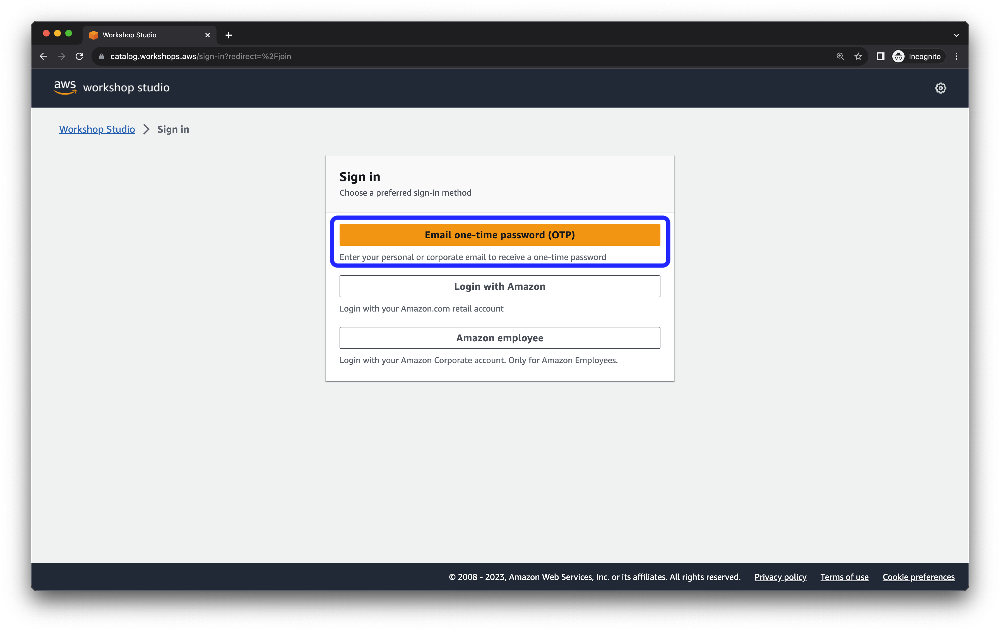
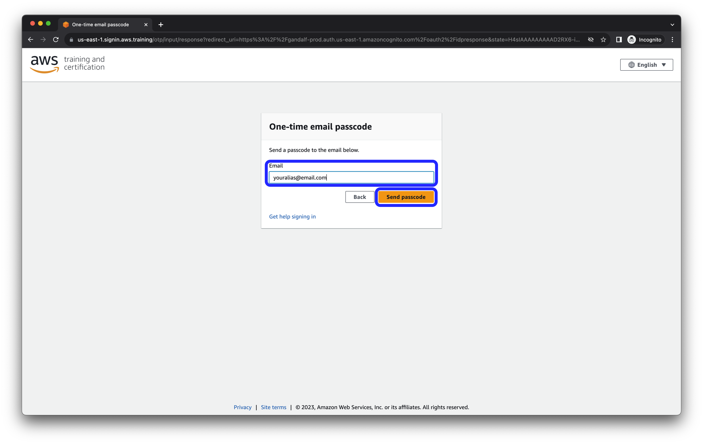
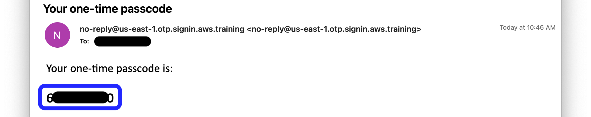
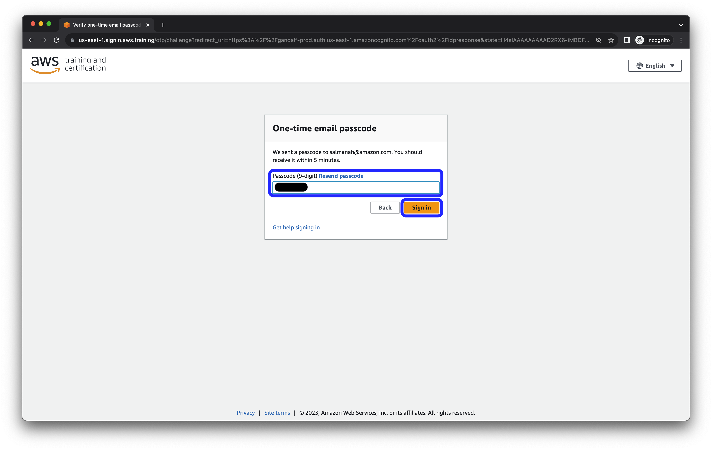
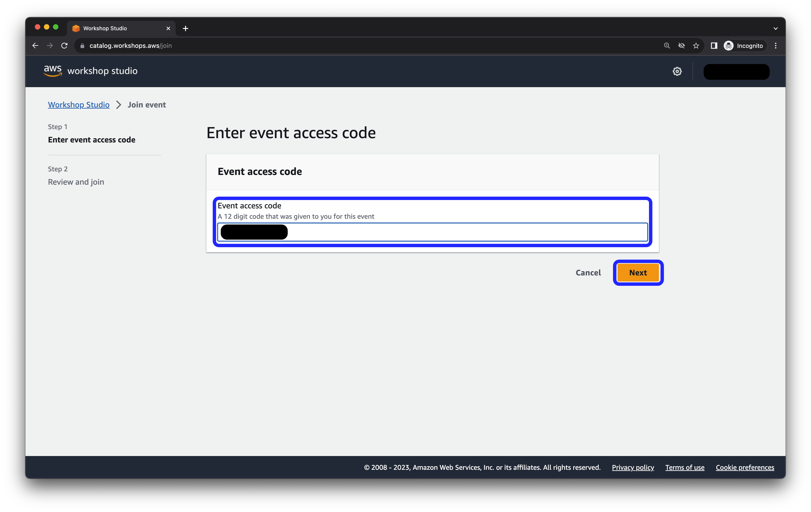
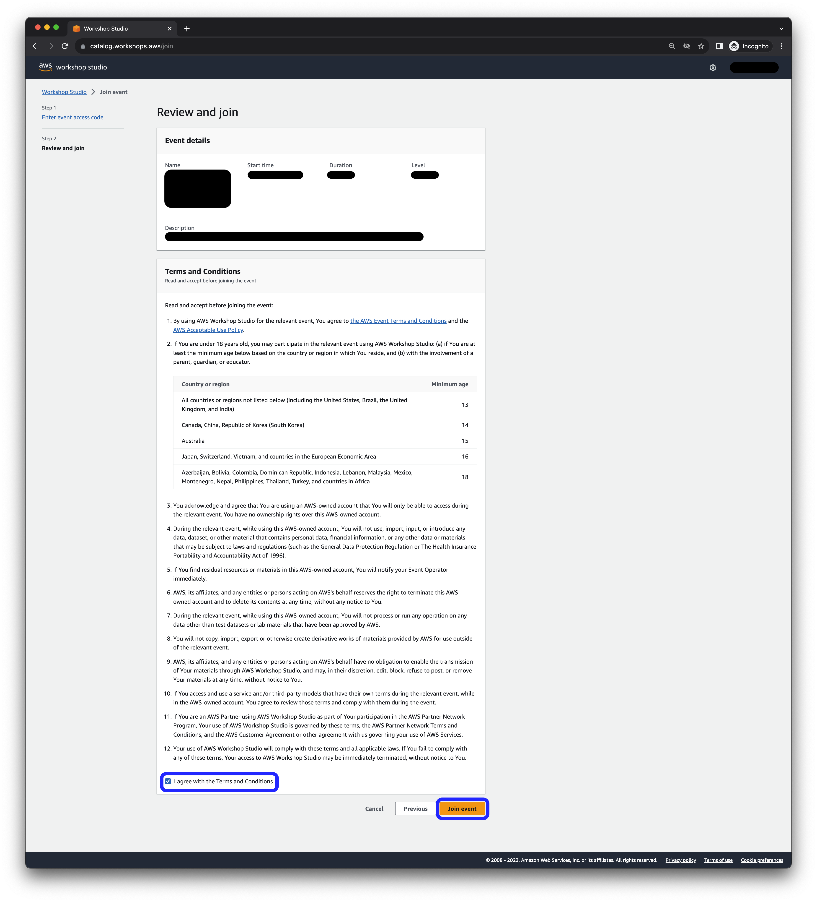
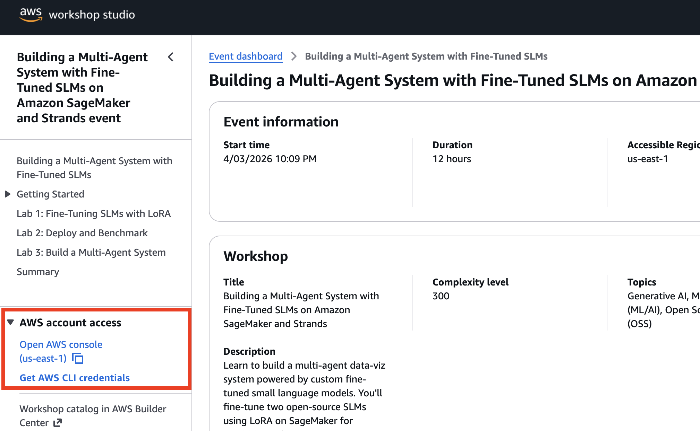
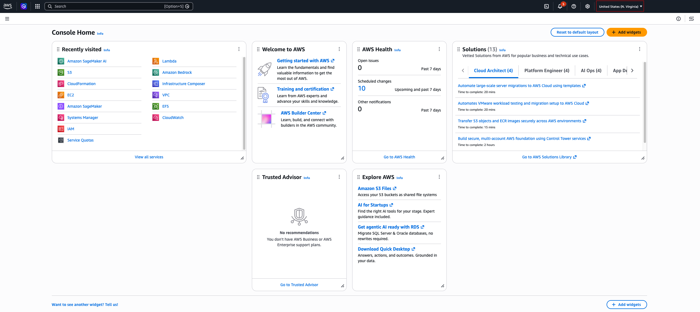

# Access your AWS Account

## At an AWS Event

1. Navigate to the Workshop Studio URL provided by your instructor.

2. Select **Email one-time password (OTP)** to sign in.

3. Enter your email address and click **Send passcode**.

4. Check your inbox for the one-time passcode.

5. Enter the passcode and click **Sign in**.

6. If prompted, enter the 12-digit **Event access code** provided by your instructor, then click **Next**.

7. Accept the terms and conditions, then click **Join event**.

8. You will land on the Workshop Studio page. Click **Open AWS Console** on the left side panel.

9. The AWS Console opens in a new tab. Check the **Region** selector in the top-right corner and confirm it matches your event's region — for most events this is **US East (N. Virginia)** (`us-east-1`), as shown below. If it shows a different region, switch to your event's region before proceeding: every later lab looks for resources created in that one region, so working in the wrong region will make them fail.

