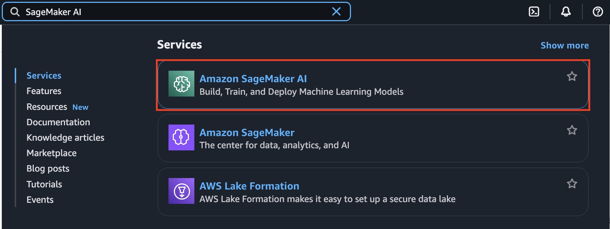
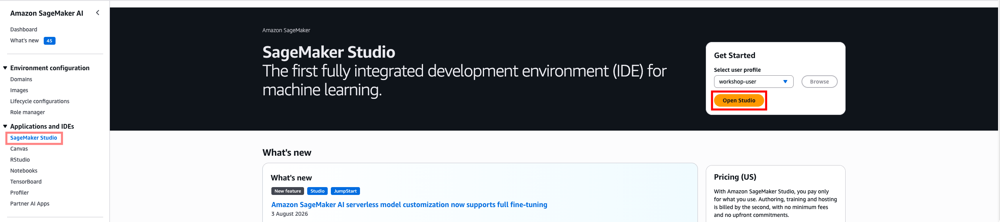
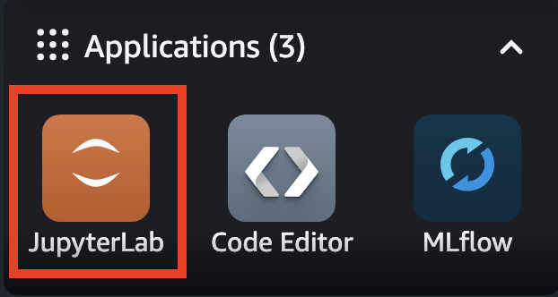
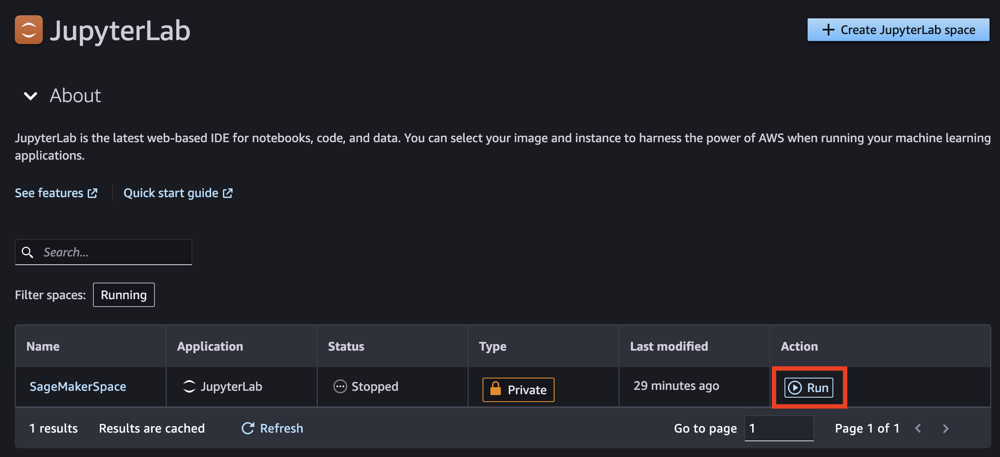
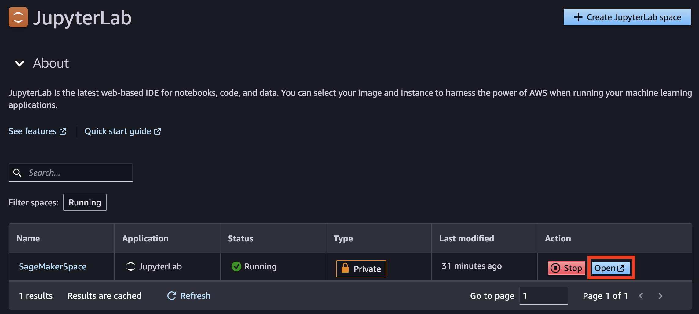
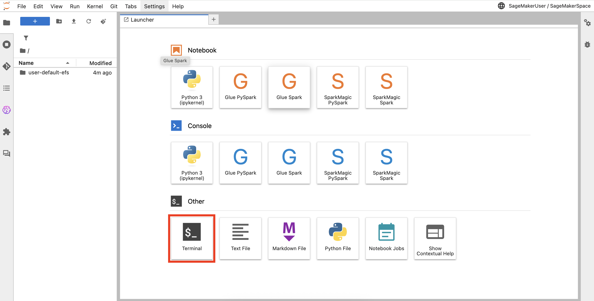

# Open SageMaker Studio

1. From the AWS Console, enter **SageMaker AI** in the Services search bar. Select **Amazon SageMaker AI** from the list.

2. In the left navigation bar, select **Studio** under **Applications and IDEs**. Click **Open Studio**.

3. In the upper left of the Studio environment, select **JupyterLab**.

4. Click **Run** to start the pre-configured JupyterLab space.

5. Once the space is running, click **Open** to launch JupyterLab.

6. JupyterLab opens with the workshop notebooks already available in the file browser on the left. You should see the following notebooks:

   - `00-setup.ipynb`
   - `01-data-preparation.ipynb`
   - `02-supervised-fine-tuning.ipynb`
   - `03-rlvr-training.ipynb`
   - `04-model-evaluation.ipynb`

::alert[If you don't see the notebooks, open a **Terminal** from the launcher and run: `aws s3 sync s3://slm-weights-$(aws sts get-caller-identity --query Account --output text)/ ~/`]{type="warning"}

