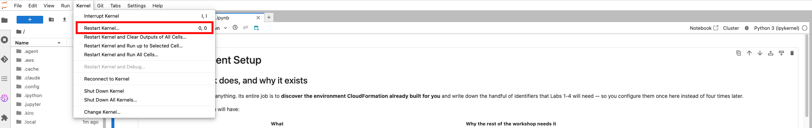

# Lab 0: Environment Setup

## What you will do

Configure the SageMaker session, create an MLflow tracking server, and persist variables that all subsequent labs depend on.

---

## Get started

1. In the JupyterLab file browser, open **`00-setup.ipynb`**.

2. Run the first cell to install the SageMaker SDK. It pins the exact versions the workshop was validated against:
   ```
   !pip install --quiet \
       sagemaker==3.18.0 \
       sagemaker-core==2.18.0 \
       sagemaker-train==1.18.0 \
       sagemaker-serve==1.18.0 \
       sagemaker-mlops==1.18.0
   ```
   Run this cell exactly as written — **do not change it to `--upgrade` or bump the versions.** The `SFTTrainer`, `RLVRTrainer`, and `CustomScorerEvaluator` APIs used in Labs 2–4 live in `sagemaker-train`, and minor releases have changed their behavior. A different version can break later labs in ways that are hard to diagnose.

   The cell prints the installed version of each package once the install finishes — confirm you see all five (`sagemaker 3.18.0`, `sagemaker-core 2.18.0`, `sagemaker-train 1.18.0`, `sagemaker-serve 1.18.0`, `sagemaker-mlops 1.18.0`) with no `pip` errors above them **before** restarting the kernel.

3. **Restart the kernel** — on the menu bar, click **Kernel** → **Restart Kernel...**. This is required for the freshly installed SDK to take effect.

   

   The restart takes a few seconds; the kernel status indicator at the top-right of the notebook returns to its idle (hollow) state once it is ready. If you run a cell before the restart finishes and see a `NameError` or an import error, nothing is broken — just wait a moment and re-run that cell.

4. Run the remaining cells. The setup cell will:
   - Detect your account ID, region, and execution role
   - Find or create an MLflow tracking server named `workshop-mlflow`
   - Store all variables via `%store` for use in later labs

5. Verify the output shows:
   - `Account Id: <your 12-digit account>`
   - `Region: <your event's region>` — the region is detected from your session, so it will match whichever region your event was provisioned in
   - `MLFlow ARN: arn:aws:sagemaker:...`

::alert[Every lab runs in a single region — the one your event provisioned. Do not switch regions in the console partway through, or later labs will fail to find the Aurora cluster and MLflow server created here. Lab 4 also calls Claude models on Amazon Bedrock, so the workshop is only deployable in regions where those models are available.]{type="warning"}

---

## Key variables stored

| Variable | Purpose |
|----------|---------|
| `ACCOUNT_ID` | AWS account identifier |
| `REGION` | Active AWS region |
| `ROLE` | SageMaker execution role ARN |
| `LAMBDA_ROLE` | IAM role for the evaluator Lambda |
| `DEFAULT_BUCKET` | S3 bucket for training artifacts |
| `MLFLOW_ARN` | ARN of the MLflow tracking server |
| `AURORA_CLUSTER_ARN` | Aurora database cluster ARN |
| `AURORA_SECRET_ARN` | Secrets Manager secret for DB credentials |
| `AURORA_DB_NAME` | Database name (`querytraining`) |

