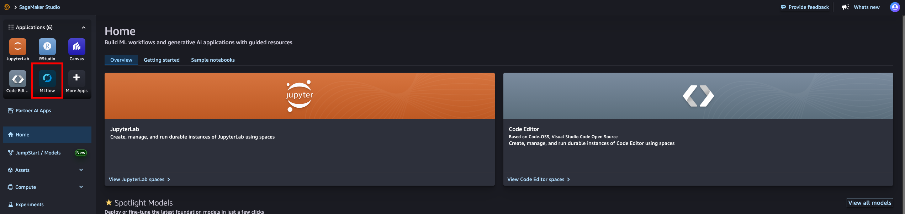

# Reviewing Results in MLflow

## What you will learn

- How to open the MLflow tracking server from SageMaker Studio
- Which lab wrote each of the eleven experiments, and what is in them
- How to read the RLVR reward curves that carry Lab 3's ablation
- How to tell a healthy training run from a stalled one
- Why `aggregate_reward` is the number that ranks the models

---

## Why bother

Every training job and every evaluation in Labs 2, 3 and 4 logged to MLflow automatically. Eleven experiments are now sitting there, and the notebooks have only shown you the final numbers from a handful of them.

The final numbers tell you *which* model won. The curves tell you **why**, and whether you should believe the result. A model that reached a good reward by step 10 and then flatlined is a different story from one still climbing at step 60 — the first is done learning, the second was cut short. You cannot tell those apart from a comparison table.

---

## Opening MLflow

Two routes. The first is faster.

1. **From SageMaker Studio** — in the left sidebar under **Applications**, click the **MLflow** tile. It sits next to JupyterLab and Code Editor, on the same panel you launched your JupyterLab space from at the start of the workshop.

   

2. **From the AWS Console** — go to **Amazon SageMaker AI**, then **MLflow** under *Applications and IDEs*, and open `workshop-mlflow`.

The notebooks also print a signed link: run the MLflow cell at the end of Lab 0, Lab 2, Lab 3, or Lab 4 to get a link that logs you straight in.

::alert[The MLflow tracking server was created by `00-setup.ipynb`, not by CloudFormation. If you cannot find it, confirm Lab 0 ran to completion.]{type="info"}

---

## The eleven experiments

| Experiment | Written by | Contents |
|---|---|---|
| `sft-training` | Lab 2 | SFT training loss over 8 epochs |
| `sft-eval-validation` | Lab 2 | Base **and** SFT model scored on the held-out 15% |
| `sft-eval-combined` | Lab 2 | Base **and** SFT model scored on the full dataset |
| `rlvr-training` | Lab 3 | SFT+RLVR reward, entropy, episode length, advantage over 60 steps |
| `rlvr-base-training` | Lab 3 | The same metrics for the ablation arm (no SFT) |
| `rlvr-eval-validation` | Lab 3 | SFT+RLVR model on the held-out set |
| `rlvr-eval-combined` | Lab 3 | SFT+RLVR model on the full dataset |
| `rlvr-ablation-eval-validation` | Lab 3 | RLVR-only model on the held-out set |
| `rlvr-ablation-eval-combined` | Lab 3 | RLVR-only model on the full dataset |
| `sota-eval-validation` | Lab 4 | Claude Haiku and Sonnet on the held-out set |
| `sota-eval-combined` | Lab 4 | Claude Haiku and Sonnet on the full dataset |

Note the asymmetry in the two `sft-eval-*` experiments: they each contain **two** runs, because Lab 2 passes `evaluate_base_model=True`. That is the only place the base Llama 3.2 3B is ever scored, and it is where Lab 4's `Llama 3.2 3B (base)` row comes from. The Lab 3 evaluators deliberately pass `False` — a second base run would only duplicate a row.

---

## Reading the training runs

### `rlvr-training` vs `rlvr-base-training` — the ablation

This is the most interesting comparison in the workshop. Open both and plot **reward** against step.

What a healthy RLVR run looks like:

| Metric | Healthy | Concerning |
|---|---|---|
| **Reward** | Bumpy but trending upward across the 60 steps | Flat from step 1, or rising then collapsing |
| **Policy entropy** | Declining — the policy is becoming more decisive | Rising, or pinned high; the model is still guessing |
| **Mean advantage** | Oscillating around 0 and settling toward it | Growing in magnitude — the run is diverging |
| **Episode length** | Stable | Climbing steadily, meaning increasingly verbose output |

Reward *should* be bumpy. Rewards here come from executing generated SQL, so they move in coarse jumps rather than smoothly, and a step where reward drops is normal. A perfectly smooth curve on a 60-step RLVR run would be more suspicious than a jagged one.

The finding to look for: **the SFT arm starts higher and stays higher.** The starting reward is measured before any gradient step, which makes it the cleanest evidence in the whole ablation — nothing about the training configuration can explain it. SFT gave the model a policy that already emits parseable SQL, so more rollouts earn reward from step 1 and there is more signal to learn from.

::alert[Be careful comparing curve *smoothness* between the two arms. The ablation arm runs at `rollout_n = 8` rather than 32 to keep the lab inside its time slot, and because `rollout_n` is the GRPO group size, its advantage estimates are inherently noisier. The direction of the result is solid; the variance difference is partly a group-size artifact. Lab 3's notebook explains this in full.]{type="warning"}

### `sft-training` — the loss curve

One curve, 8 epochs, and it should descend.

The thing to watch for is what overfitting looks like on ~200 examples: loss continuing to fall while it stops meaning anything. With a dataset this small, 8 epochs is enough for the model to start memorizing specific queries rather than learning the mapping. That is partly why LoRA is used here — far fewer trainable parameters means less capacity to memorize — and it is why the held-out validation score in `sft-eval-validation` matters more than the training loss.

**Loss going down only tells you the model matched your examples more closely. It does not tell you the model writes correct SQL.** That is what the evaluation experiments are for.

---

## Reading the evaluation runs

The six SageMaker AI evaluation experiments each contain one or two runs with four metrics:

| Metric | What it measures |
|---|---|
| `execution_success` | Did the generated SQL run at all |
| `execution_accuracy` | Exact, **order-sensitive** match of the result rows |
| `result_set_f1` | Set F1 over result rows — order-insensitive, gives partial credit |
| `aggregate_reward` | `0.3 × execution_success + 0.7 × result_set_f1` |

**`aggregate_reward` is the ranking number.** It is what RLVR optimized in Lab 3 and what Lab 4 sorts by. Two properties are worth remembering when you read it:

- It has a **floor of about 0.30** for anything that merely parses, because `execution_success` carries 0.3 of the weight. A base model scoring ~0.43 is not "43% correct" — the useful range is roughly 0.3 to 1.0.
- `execution_accuracy` will look punishingly low even for good models. It compares result rows as ordered lists, so a correct query with a different `ORDER BY` scores zero. Some of that gap is a measurement artifact, not a capability gap. Lab 2's notebook covers all four metrics in detail.

### Identifying which model a run refers to

Run names come from the evaluator, not from you, so they identify the *job* rather than the model. Two things disambiguate them:

- **`EvaluateBaseModel` vs `EvaluateCustomModel` in the run name** — base checkpoint versus the fine-tuned one.
- **The experiment the run lives in** — `sft-eval-*` versus `rlvr-eval-*` versus `rlvr-ablation-eval-*`.

You need both. `EvaluateCustomModel` in `rlvr-eval-validation` is the SFT+RLVR model; the same run name in `rlvr-ablation-eval-validation` is the RLVR-only model. This is exactly the logic Lab 4's `get_display_name()` function implements, and it is why that function takes the experiment name as an argument.

The two `sota-eval-*` experiments are different: Lab 4 ran that inference itself and logged the runs by hand, so those runs are named after the models directly.

---

## What is not here

**The Artifacts tab is empty.** This workshop logs metrics and parameters but never calls `mlflow.log_artifact()`, so there are no saved plots, no model files, and no sample predictions in MLflow. Model weights live in S3 and are registered as SageMaker AI model packages instead.

Worth knowing as a gap rather than a defect: on a real project, logging a sample of generated-versus-expected SQL as an artifact per evaluation is one of the highest-value things you can add. Aggregate metrics tell you the score moved; the failing examples tell you *why*, and they are the only way to notice that your reward function is rewarding something you did not intend.

---

## Next

That is the full picture: eleven experiments, three training runs, eight evaluations, and one clear result. Return to **Lab 4** for the cleanup notes if you are running this outside an AWS event.
