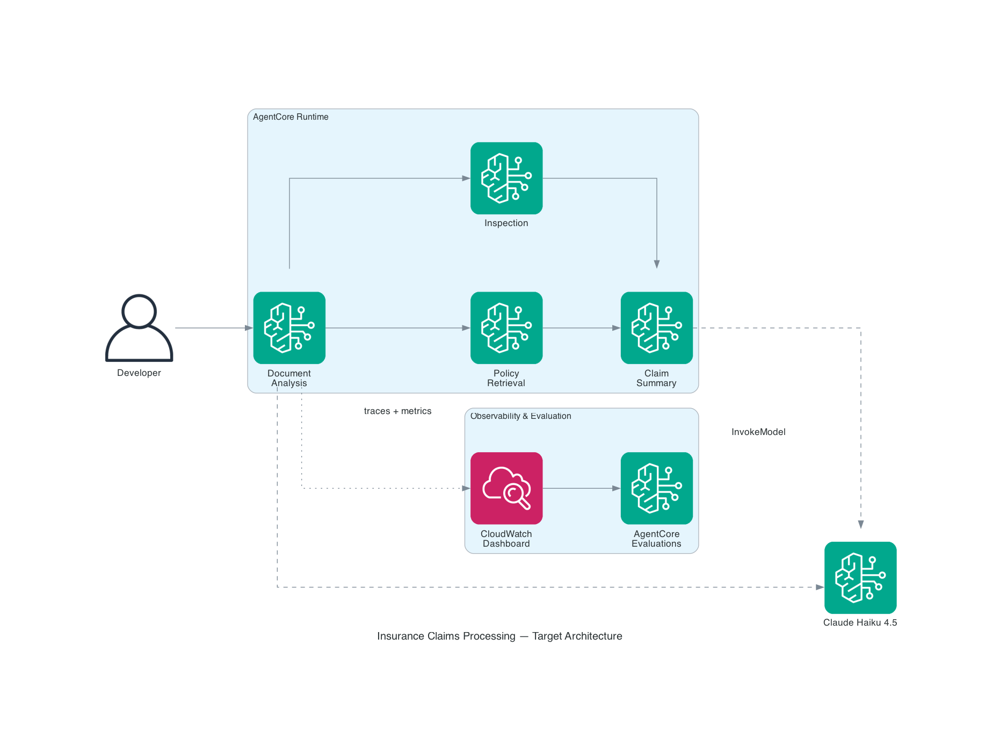

# Building and Evaluating Agents Workshop

A hands-on workshop for building a multi-agent insurance claims pipeline with the [Strands Agents SDK](https://strandsagents.com/) and Amazon Bedrock, instrumenting it with operational metrics in Amazon CloudWatch, and evaluating output quality using both programmatic testing and [Amazon Bedrock AgentCore](https://docs.aws.amazon.com/bedrock-agentcore/latest/devguide/what-is-bedrock-agentcore.html) evaluators. Requires an AWS account with Claude Haiku 4.5 enabled in Bedrock, Python 3.10+, a Jupyter environment, and the IAM permissions listed under [Prerequisites](#prerequisites).

**Level:** 300 (Intermediate) · **Duration:** ~2 hours · **Cost:** ~$1–5 for full completion

> **Before you start:** you'll need an AWS account, Python 3.10+, a Jupyter environment, Anthropic Claude Haiku 4.5 model access enabled in Amazon Bedrock, and AWS credentials with the IAM permissions listed under [Prerequisites](#prerequisites) below. Plan 5–10 minutes for account setup (model access approval in Bedrock is usually instant but can take longer).

> **Disclaimer:** This workshop is intended for learning and experimentation. The code and architecture are not production-ready — they omit authentication, input validation, error recovery, and other safeguards required for real workloads. See the [AWS Well-Architected Framework](https://aws.amazon.com/architecture/well-architected/) before adapting any patterns for production use.

## What you'll build

Four specialized agents that collaborate through a graph workflow with parallel execution and conditional routing:

| Agent | Responsibility |
|-------|---------------|
| Document Analysis | Extracts structured claim data from submitted documents |
| Policy Retrieval | Looks up relevant coverage and deductibles |
| Inspection | Identifies fraud indicators and risk factors |
| Claim Summary | Compiles everything into an actionable report |

### Target Architecture (with AgentCore)



## Labs

| # | Lab | Duration |
|---|-----|----------|
| 00 | [Introduction — Key Concepts](./00_Introduction/) | 10 min reading |
| 01 | [Multi-Agent Implementation](./01_Multi_agent_implementation/) | 30–45 min |
| 02 | [Operational Metrics](./02_Operational_metrics/) | 30 min |
| 03 | [Quality Evaluation](./03_Quality_evaluation/) | 40 min |

Code reused across labs lives in [`shared/`](./shared/) — see "Shared files per lab" below.

---

## Getting started

### Prerequisites

- An AWS account you control (do **not** run this in a production account)
- **Anthropic Claude Haiku 4.5** enabled in Amazon Bedrock for your target region — see [Manage model access](https://docs.aws.amazon.com/bedrock/latest/userguide/model-access-modify.html). `us-east-1` or `us-west-2` recommended.
- Python 3.10+
- A Jupyter environment — either [Amazon SageMaker AI Notebook Instances](https://docs.aws.amazon.com/sagemaker/latest/dg/nbi.html) / [SageMaker Studio](https://docs.aws.amazon.com/sagemaker/latest/dg/studio.html), or a local JupyterLab
- AWS credentials configured (via `aws configure`, SSO, or an instance role) with the permissions listed below

### Clone and install

```bash
git clone https://github.com/aws-samples/multi-agent-system-evaluations.git
cd multi-agent-system-evaluations
pip install -r shared/requirements.txt
```

**Shared files per lab.** Lab 2 and Lab 3 reuse the multi-agent implementation you build in Lab 1. The canonical copies of `claims_agents.py` and `agentcore_entrypoint.py` live in [`shared/`](./shared/) — before running Lab 2 or Lab 3, copy the files the lab needs into that lab's directory so imports resolve:

```bash
# Before Lab 2
cp shared/claims_agents.py 02_Operational_metrics/

# Before Lab 3
cp shared/claims_agents.py shared/agentcore_entrypoint.py 03_Quality_evaluation/
```

Each lab README repeats the exact command it needs.

### Required IAM permissions

Your execution role or IAM user needs the service actions listed below. Use a least-privilege customer-managed policy containing only these actions — do **not** attach the broad `AmazonBedrockFullAccess` managed policy, which grants permissions beyond what this workshop needs. The scoped action lists below are sufficient for every cell in every lab.

**Labs 1 & 2 — core agent workflow and CloudWatch metrics**

| Purpose | Actions |
|---------|---------|
| Invoke Bedrock models | `bedrock:InvokeModel`, `bedrock:InvokeModelWithResponseStream`, `bedrock:ListFoundationModels`, `bedrock:GetFoundationModel`, `bedrock:ListInferenceProfiles`, `bedrock:GetInferenceProfile` — scoped to the Claude Haiku 4.5 model/inference profile ARNs where possible |
| Publish metrics and dashboards | `cloudwatch:PutMetricData`, `cloudwatch:GetMetricData`, `cloudwatch:ListMetrics`, `cloudwatch:PutDashboard`, `cloudwatch:GetDashboard`, `cloudwatch:ListDashboards`, `cloudwatch:DeleteDashboards` |
| CloudWatch Logs | `logs:CreateLogGroup`, `logs:CreateLogStream`, `logs:PutLogEvents`, `logs:DescribeLogGroups`, `logs:StartQuery`, `logs:GetQueryResults`, `logs:FilterLogEvents`, `logs:GetLogEvents` |

**Lab 3 — Bedrock AgentCore evaluations (optional deployment to AgentCore Runtime)**

| Purpose | Actions / Policy |
|---------|------------------|
| Run AgentCore evaluations | `bedrock-agentcore:ListEvaluators`, `bedrock-agentcore:GetEvaluator`, `bedrock-agentcore:CreateEvaluator`, `bedrock-agentcore:UpdateEvaluator`, `bedrock-agentcore:DeleteEvaluator`, `bedrock-agentcore:Evaluate`, `bedrock-agentcore:ListSessions` |
| Pass IAM role to AgentCore evaluator | `iam:CreateRole`, `iam:AttachRolePolicy`, `iam:PutRolePolicy`, `iam:PassRole`, `iam:GetRole` scoped to `arn:aws:iam::*:role/AmazonBedrockAgentCoreEvals*` |
| Deploy to AgentCore Runtime (optional) | See [AgentCore Runtime IAM reference](https://docs.aws.amazon.com/bedrock-agentcore/latest/devguide/runtime-permissions.html) — includes `bedrock-agentcore:*AgentRuntime*`, `codebuild:*`, `ecr:*`, and scoped S3 access to `bedrock-agentcore*` buckets |

**If you're using SageMaker**, the default SageMaker execution role created with new notebook instances doesn't include Bedrock access. Attach a customer-managed policy containing the Bedrock actions listed above — avoid the broad `AmazonBedrockFullAccess` managed policy.

See the [Amazon Bedrock IAM documentation](https://docs.aws.amazon.com/bedrock/latest/userguide/security-iam.html) and the [AgentCore IAM documentation](https://docs.aws.amazon.com/bedrock-agentcore/latest/devguide/security-iam.html) for full references.

### Region and model

The notebooks default to `us-east-1` and Claude Haiku 4.5 via inference profile `us.anthropic.claude-haiku-4-5-20251001-v1:0`. To change regions, update the model ID / region in the first setup cell of each notebook — note that the inference profile prefix (`us.`, `eu.`, `apac.`) must match your region.

---

## Running the workshop

1. Open [`00_Introduction/README.md`](./00_Introduction/) for the concepts.
2. Work through labs in order — each one imports code or patterns from the previous.
3. Follow the cleanup steps below when you're done.

## Cleanup

The last cell in Lab 3 contains a one-click cleanup script that removes all workshop resources (AgentCore Runtime, CloudWatch dashboard, custom evaluators, and staging S3 buckets). Run it when you're done to avoid ongoing charges.

CloudWatch custom metrics published to the `ClaimsProcessing/GenAI` namespace expire automatically after 15 months of no new data and incur no ongoing cost. CloudWatch log groups are negligible but can be deleted manually from the [CloudWatch console](https://console.aws.amazon.com/cloudwatch/home#logsV2:log-groups) if desired.

---

## Repository structure

```
.
├── 00_Introduction/              # Key concepts (agents, multi-agent patterns, evaluation)
├── 01_Multi_agent_implementation/
│   └── lab1-multi-agent-system.ipynb
├── 02_Operational_metrics/
│   └── lab2-operational-metrics.ipynb   # copy shared/claims_agents.py here before running
├── 03_Quality_evaluation/
│   └── lab3-quality-metrics.ipynb       # copy shared/claims_agents.py + agentcore_entrypoint.py here
└── shared/
    ├── claims_agents.py          # Reusable multi-agent implementation (from Lab 1)
    ├── agentcore_entrypoint.py   # AgentCore Runtime entrypoint (used in Lab 3)
    └── requirements.txt
```

---

## Security

See [SECURITY.md](SECURITY.md) for vulnerability reporting.

## Contributing

See [CONTRIBUTING.md](CONTRIBUTING.md).

## License

This library is licensed under the MIT-0 License. See the [LICENSE](LICENSE) file.
