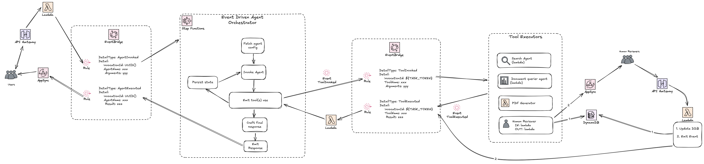

# Deep Research Agent

This repository implements an event-driven architecture for deep research agents using AWS services. It addresses key challenges of long running AI Agents in distributed systems.

The main focus is to build an event-driven AI Agent providing a stateful, long-running system that enables comprehensive research with human-in-the-loop capabilities.

## Project Overview

This research agent performs deep research based on users' queries on any topic. The system not only extracts and synthesizes information from multiple sources but also incorporates human reviewer feedback in the process.

### Why This Matters for Startups

Startups building AI solutions face significant challenges:

1. **Session Limitations**: Traditional agent frameworks terminate after short periods, disrupting complex research workflows
2. **State Persistence**: Maintaining context across multiple research steps is critical for comprehensive analysis
3. **Human Review Requirements**: Complex information requires expert validation, but integrating human feedback is clunky in traditional agent frameworks
4. **Scalability Constraints**: Direct integration patterns can limit throughput for research-intensive applications

This architecture solves these problems by:

1. **Decoupling Components**: Using Amazon EventBridge for asynchronous communication between research and review steps
2. **Persisting State**: Storing workflow state in AWS Step Functions and Amazon DynamoDB
3. **Enabling Human-in-the-Loop**: Seamlessly incorporating human reviewer feedback in the research process
4. **Supporting Long-Running Processes**: Breaking complex research into event-driven microservices
5. **Providing Flexibility**: Allowing research tools to be developed and scaled independently

## Architecture Overview

The system follows an event-driven architecture with the following components:

1. **Orchestrator**: Manages the agentic loop using AWS Step Functions and coordinates between different tools
2. **Tool: Search Agent**: Performs research of sub-topics using Linkup Search API and summarizes findings with Amazon Bedrock
3. **Tool: PDF Generator**: Creates PDF reports from research findings
4. **Tool: Human Reviewer**: Allows experts to review and provide feedback on research results
5. **End User Frontend**: Provides an interface for users to submit research queries and receive results

All components communicate through a central Amazon EventBridge bus, allowing for loose coupling and independent scaling.



## Key Benefits

### Seamless Human-in-the-Loop Integration
AWS Step Functions powers this agent with seamless human in the loop capabilities. With STANDARD workflows, AWS Step Function state machines can run for up to 1 year allowing deep research with human-in-the-loop capabilities. This gives you plenty of room when you are not in control of when human reviews will happen.

### Persistent State
The architecture maintains state in AWS Step Functions and Amazon DynamoDB, allowing research processes to run for days or weeks if needed, with human review steps in between.

### Asynchronous Processing
Research tools can take as long as needed to complete their tasks without timing out the main agent session, enabling deeper and more thorough analysis.

### Scalability
Each research component can be scaled independently based on demand, allowing for more efficient resource utilization during intensive research tasks.

### Flexibility
New research tools and data sources can be added without modifying existing components, enabling rapid iteration and experimentation with different information sources.

## Implementation Status

This project demonstrates the core architectural pattern with the following components implemented:

- ✅ Event-driven communication infrastructure with Amazon EventBridge
- ✅ Search Agent implementation with Linkup
- ✅ Orchestrator implementation with AWS Step Functions
- ✅ State persistence with Amazon DynamoDB
- ✅ Document storage with Amazon Simple Storage Service (Amazon S3)
- ✅ Human Reviewer interface
- ✅ PDF Generator implementation
- ✅ End User Frontend

## Deployment

The project is deployed using AWS CDK with TypeScript.

### Prerequisites

- [AWS CLI installed](https://docs.aws.amazon.com/cli/v1/userguide/cli-chap-install.html) and [credentials configured](https://docs.aws.amazon.com/cli/v1/userguide/cli-chap-configure.html)
- Node.js and npm installed
- Linkup Search API key

### Deployment Steps

1. Install dependencies:
   ```bash
   npm install
   ```

2. Set your Linkup Search API key as an environment variable:
   ```bash
   export LINKUP_API_KEY=your-api-key
   ```

3. Bootstrap your AWS environment (if not already done):
   ```bash
   cdk bootstrap
   ```

4. Synthesize the CloudFormation template:
   ```bash
   cdk synth
   ```

5. Deploy the stack:
   ```bash
   cdk deploy
   ```

6. Copy the CDK output values to a .env file in the frontend directory (use frontend/.env.example as reference):
   ```bash
   cp frontend/.env.example frontend/.env
   # Edit frontend/.env with the actual values from CDK output
   ```

7. Deploy the Human Reviewer Frontend:
   ```bash
   npm install
   npm run dev
   ```

## IMPORTANT DISCLAIMER

This code sample is provided for demonstration purposes only to illustrate an architectural pattern. It is not intended for use in production environments without proper security and compliance considerations. 

This demonstration:
- Does not provide enhanced security features required for protecting sensitive data
- Does not validate compliance with data protection regulations
- Does not include comprehensive error handling and data validation
- May not follow all industry best practices for data management

Before implementing any system that processes sensitive information, you:
- Should engage with your compliance and legal teams
- Should implement appropriate security controls and data protection measures
- Should verify compliance with applicable regulations in your region
- May need to obtain necessary certifications and approvals
- Should conduct thorough security assessments

AWS offers resources for building secure solutions that can help provide enhanced security features and enable compliance:
- [AWS Security Best Practices](https://aws.amazon.com/security/security-learning/)
- [AWS Well-Architected Framework](https://aws.amazon.com/architecture/well-architected/)
- [AWS Compliance Center](https://aws.amazon.com/compliance/)

The user expects to validate all security and compliance requirements for their specific use case.
