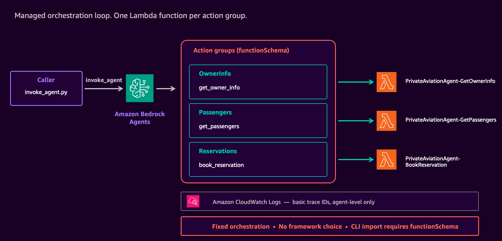
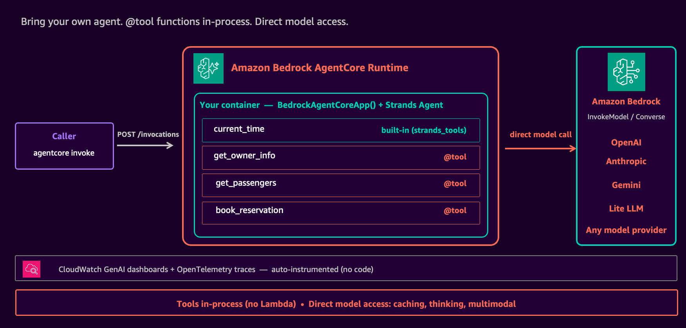

# Private aviation agent on AWS — three ways

A single agent, rebuilt three times, to make the evolution of agent development on AWS concrete. The same private-aviation reservation agent ships in three styles:

1. **Amazon Bedrock Agents (2024)** — declarative agent with a managed orchestration loop and OpenAPI action groups backed by AWS Lambda functions
2. **Amazon Bedrock AgentCore Runtime (2025)** — bring-your-own-agent on a managed runtime; your code, your loop, every Bedrock feature and every model provider
3. **Amazon Bedrock AgentCore Harness (2026, preview)** — managed loop with a configurable ceiling; declarative by default, custom containers and shell access when the workload needs them

> A companion blog post walks through the evolution and the architectural trade-offs in depth. **Link will be added here once published.**

---

## Use case

A CEO's personal assistant calls a private jet company:

> "Mr. John Doe (OwnerId: 9612f6c4-b7ff-4d82-b113-7b605e188ed9) is planning for a surprise trip to Disney World in 5 hours with his family. Please book a reservation for them."

Three tools resolve the request:

| Tool | Purpose |
|---|---|
| `get_owner_info(ownerId)` | Retrieve the owner profile and home airport (returns KJFK, the departure point) |
| `get_passengers(ownerId)` | List registered family members (Jill, Jane, Jenny) |
| `book_reservation(...)` | Book the private jet flight given airports, date, and manifest |

The model chains the three tools with inference between each step. "Disney World" maps to Orlando (KMCO). "Home airport" determines departure (KJFK). "5 hours" resolves to an absolute time. "Family" means retrieving all registered passengers.

---

## Architecture at a glance

### Phase 1 — Bedrock Agents



Hand [Amazon Bedrock Agents](https://aws.amazon.com/bedrock/agents/) a foundation model, a system prompt, and a set of OpenAPI-described tools backed by [AWS Lambda](https://aws.amazon.com/lambda/) functions. The managed loop handles reasoning, tool routing, and session state, and streams agent-level traces to [Amazon CloudWatch](https://aws.amazon.com/cloudwatch/) Logs. See the [Phase 1 walkthrough](1-bedrock-agents/README.md).

### Phase 2 — AgentCore Runtime



The [Amazon Bedrock AgentCore](https://aws.amazon.com/bedrock/agentcore/) Runtime inverts the contract. You build the agent in any framework (Strands in this sample); Runtime handles scaling, networking, IAM, and observability around a simple HTTP contract (`POST /invocations`, `GET /ping`). Every Bedrock feature (prompt caching, extended thinking, multimodal input, parallel tool calls) opens up, and the model provider is no longer limited to Bedrock. A second variant demonstrates the migration-friendly path: the Phase 1 Lambda functions stay, wrapped behind an AgentCore Gateway that the Strands agent calls over MCP. See the [Phase 2 walkthrough](2-agentcore/README.md).

### Phase 3 — AgentCore Harness


AgentCore Harness is a managed agent runtime with a clear contract: defaults at creation time, overrides at invocation time. Declare the agent once in `harness.json` (model, tools, instructions, memory, environment); override any of those per invocation without redeploying. The Phase 2 Gateway attaches to the harness as a first-class `agentcore_gateway` tool, so the Lambda investment carries forward without a rewrite. See the [Phase 3 walkthrough](3-agentcore-harness/README.md).

---

## Repository layout

```
1-bedrock-agents/       Phase 1 — Bedrock Agents (CDK + Lambda + OpenAPI)
2-agentcore/            Phase 2 — AgentCore Runtime (Strands, via agentcore CLI import)
3-agentcore-harness/    Phase 3 — AgentCore Harness (declarative + Gateway-wrapped Lambdas)
LICENSE                 MIT-0
```

---

## Prerequisites

- AWS CLI configured with credentials
- Python 3.10 or later
- AWS CDK CLI (`npm install -g aws-cdk`)
- [AgentCore CLI](https://www.npmjs.com/package/@aws/agentcore) for Phase 2 (`npm install -g @aws/agentcore`)
- [AgentCore CLI preview](https://www.npmjs.com/package/@aws/agentcore) for Phase 3 (`npm install -g @aws/agentcore@preview`, v1.0.0-preview or later for first-class Harness support)
- Access to Claude Sonnet 4 on Amazon Bedrock
- AgentCore Harness preview access (Phase 3) in one of: `us-east-1`, `us-west-2`, `ap-southeast-2`, `eu-central-1`

All three phases default to `us-east-1`.

**Before deploying Phase 2 or Phase 3**, edit `aws-targets.json` in the phase directory and replace the placeholder account ID `123456789012` with your own. Find it with:

```bash
aws sts get-caller-identity --query Account --output text
```

---

## Quickstart

### Phase 1 — Bedrock Agents

```bash
cd 1-bedrock-agents/cdk
python3 -m venv .venv && .venv/bin/pip install -r requirements.txt
PATH=".venv/bin:$PATH" cdk bootstrap      # first time in this account/region
PATH=".venv/bin:$PATH" cdk deploy
cd .. && python3 invoke_agent.py
```

Teardown: see [`1-bedrock-agents/README.md#clean-up`](1-bedrock-agents/README.md#clean-up).

### Phase 2 — AgentCore Runtime

After deploying Phase 1, import the Bedrock Agent to AgentCore:

```bash
agentcore create --type import \
  --agent-id <AGENT_ID> --agent-alias-id <ALIAS_ID> \
  --region us-east-1 --framework Strands
```

Or use the pre-generated snapshot in `2-agentcore/` — the three tool bodies are filled in against in-memory fixtures, ready to deploy:

```bash
cd 2-agentcore/PrivateAviationAgent
( cd agentcore/cdk && npm install )
# Edit agentcore/aws-targets.json with your account ID, then:
agentcore deploy --yes
agentcore invoke "Mr. John Doe (OwnerId: 9612f6c4-b7ff-4d82-b113-7b605e188ed9) is planning for a surprise trip to Disney World in 5 hours with his family. Please book a reservation for them."
```

Teardown: see [`2-agentcore/README.md#clean-up`](2-agentcore/README.md#clean-up).

### Phase 3 — AgentCore Harness

```bash
cd 3-agentcore-harness
pip install boto3
# Edit project/PvtAviation/agentcore/aws-targets.json with your account ID, then:
make deploy       # IAM, Lambdas, agentcore scaffold, Gateway, Harness, deploy
make invoke       # send the demo booking prompt
```

Teardown: see [`3-agentcore-harness/README.md#clean-up`](3-agentcore-harness/README.md#clean-up).

---

## Observability

```bash
agentcore traces list --last 1h
```

---

## License

This sample is licensed under the terms of the [MIT-0 License](LICENSE).
