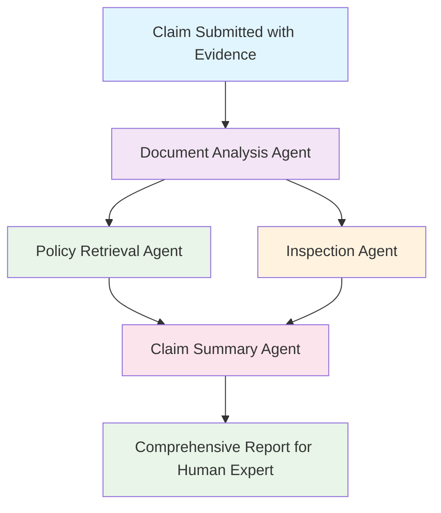
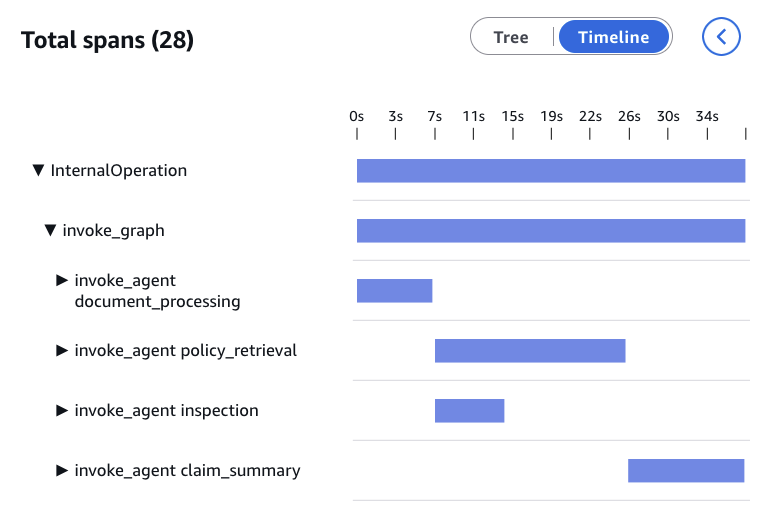

# Strands Graph Multi-Agent Orchestration Sample

This is a **multi-agent tutorial** designed to demonstrate how agents can work together in a graph pattern and be processed in parallel with Strands Agents, Amazon Bedrock; and Amazon Bedrock AgentCore Observability. The system showcases collaborative AI workflows where specialized agents contribute their expertise to create comprehensive analysis reports. The example is an insurance claim with data from multiple documents.

**Key features:**

- **Graph-based multi-agent orchestration** with conditional edges and dependency management
- **Structured output** using Pydantic models with validation gates in graph execution
- **Tool use** across specialized agents for document analysis & policy retrieval
- **Multimodal analysis** capabilities, handling both text documents and images
- **Real-time observability** with traces, spans, and session tracking through AgentCore Observability

**Important Disclaimer**: This system is **not a decision-making agent** to approve or deny insurance claims and does not have the capability to make informed decisions. It serves solely as an information extraction and analysis tool that processes documents and policies to provide humans with relevant, organized information. **All outputs must be reviewed by qualified human insurance professionals** as this system only analyzes content and provides analysis for human decision-making.

This sample is **not intended to be used in production** (see Security section).

## 🏗️ System Architecture

The system uses a [Strands Graph](https://strandsagents.com/latest/documentation/docs/user-guide/concepts/multi-agent/graph/) pattern to orchestrate four specialized agents in a Graph flow:

1. **Document Analysis Agent** - Analyzes claim data with **multimodal input** (photos + documents) and returns a **structured output**
2. **Policy Retrieval Agent** - Retrieves and analyzes policy information from a local knowledge base with **tool use / function calling**
3. **Inspection Agent** - Identifies inconsistent information and highlights points of attention for review
4. **Claim Summary Agent** - Compiles comprehensive claim information for human insurance experts

## 🔄 Analysis Flow



## 🎯 Key Demonstrations

This tutorial showcases two important capabilities:

### 1. 📊 Observability with AgentCore

The system demonstrates comprehensive observability through Amazon Bedrock AgentCore, providing real-time visibility into agent execution:

- **Traces and spans**: Visual representation of agent execution flow and timing
- **Session tracking**: Correlation of multiple agent interactions within a single claim analysis session
- **Performance metrics**: Detailed insights into analysis times, token usage, and system performance

For example, you can see the Policy Retrieval and Inspection agents run in parallel:



_AgentCore Observability dashboard showing traces, spans, and session data for multi-agent claim analysis_

### 2. 🏗️ Structured Output with Conditional Edges

The Document Analysis Agent demonstrates structured output using Pydantic models, with the main graph implementing conditional edges that wait for structured validation:

- **Structured output**: The Document Analysis Agent returns validated JSON using `DocumentAnalysisResult` Pydantic model
- **Conditional routing**: The graph waits for the structured output's `status` field before proceeding to other agents
- **Validation gates**: Only claims with `status: "valid"` proceed to Policy Retrieval and Inspection agents
- **Dependency management**: The Claim Summary Agent waits for all dependencies to complete successfully

```python
# Conditional edge that checks structured output
def _document_analysis_valid(self, state: GraphState) -> bool:
    """Check if document analysis completed successfully with valid status."""
    doc_analysis_result = state.results.get("document_analysis")
    structured_result = doc_analysis_result.result.structured_output
    return structured_result.status == "valid"
```

## 🚀 Quick Start

### Prerequisites

- **Python 3.12+** (tested with 3.12)
- **uv** - Fast Python package manager ([installation guide](https://docs.astral.sh/uv/getting-started/installation/))
- **AWS Account** with Amazon Bedrock access and proper permissions to access Amazon Nova models
- **Strands Agents SDK** (v1.7.0+)

### Installation

1. Clone the repository:

```bash
git clone aws-samples/sample-genai-startups
cd sample-genai-startups/agentic-samples/multi-agent-graph-with-observability
```

2. Install dependencies using uv:

```bash
# Create virtual environment and install dependencies
uv sync

# For development tools (optional)
uv sync --extra dev
```

3. Make sure you have access to Amazon Bedrock:

4. Configure AWS credentials using AWS CLI:

```bash
aws configure
```

## 💼 Usage Examples

### Example 1: Basic Usage

Run the sample car claim summary script directly:

```bash
uv run python sample-usage/car_claim.py
```

This will process a sample auto insurance claim with photo evidence and display the comprehensive analysis results for human expert review.

### Example 2: With AgentCore Observability and OpenTelemetry (Optional)

For production-grade monitoring with CloudWatch integration, follow these steps:

1. Create the necessary AWS CloudWatch log groups and streams for telemetry data, and enable X-Ray Transaction Search to allow viewing agent traces in the CloudWatch console. It's a one-time setup that configures the AWS infrastructure needed for observability before you start running your instrumented application. To do this, follow the steps [here](https://docs.aws.amazon.com/bedrock-agentcore/latest/devguide/observability-configure.html#observability-configure-builtin).

**Optionally**, you can use this script which automates the above steps:

```bash
uv run setup_observability.py
```

2. Configure and source the observability environment file:

```bash
# Source the file to set environment variables
source observability_env.sh
```

3. Run with OpenTelemetry instrumentation:

```bash
uv run opentelemetry-instrument python sample-usage/car_claim.py
```

This enables real-time tracing, performance metrics, and CloudWatch dashboards for monitoring agent execution flow and decision-making.

## 📁 Project Structure

```
claims-assistant/
├── .gitignore                     # Git ignore rules
├── .pylintrc                      # Python linting configuration
├── README.md                      # This file
├── LICENSE                        # MIT License
├── pyproject.toml                 # Project configuration and dependencies
├── uv.lock                        # Locked dependencies
├── multi_agent_graph_sample.py  # Main system implementation with Graph orchestration
├── setup_observability.py         # CloudWatch setup for observability
├── observability_env.sh           # Environment configuration for observability
├── example_logging.py             # Logging configuration examples
├── docs/                          # Documentation and assets
│   └── spans.png                  # AgentCore observability dashboard screenshot
├── kb/                          # Mockup knowledge base
│   └── photos/                    # Contains 1 generated mockup photo for the sample usage demonstration
│   └── policies/                  # Contains 1 generated mockup policy
├── lib/                         # Supporting Python modules
│   ├── __init__.py
│   ├── config.py                  # System configuration and model settings
│   ├── data_models.py             # Data structures (ClaimData, AnalysisResult)
│   ├── knowledge_base.py          # Policy and business rules knowledge base
│   └── logging_config.py          # Centralized logging configuration
├── agents/                        # Specialized agent implementations
│   ├── __init__.py                # Agent package exports
│   ├── document_analysis_agent.py  # Multimodal document and image analysis with structured output
│   ├── policy_retrieval_agent.py     # Policy analysis and coverage evaluation
│   ├── inspection_agent.py           # Inspection and risk assessment
│   └── claim_summary_agent.py        # Comprehensive claim summary compilation
└── sample-usage/                  # Usage examples
    ├── car_claim.py               # Sample car insurance claim summary
```

**Note**: The sample photo in `kb/photos/` was generated using a diffusion model for demonstration purposes and do not represent real insurance claims or incidents. The auto policy in `kb/policies` is generated mockup data.

## 🔧 Configuration

The sample can be configured through `lib/config.py`:

- **Model settings**: Amazon Bedrock settings, model choice and parameters (i.e. temperature)
- **Graph settings**: Execution timeouts (600s total, 120s per node), retry policies

## How to use

Here is how to import and use the analyzer:

```python
from multi_agent_graph_sample import ClaimsAssistant
from lib.data_models import ClaimData

# Create processor with Graph-based orchestration
processor = ClaimsAssistant()

# Create claim data with photos and documents
claim = ClaimData(
    claim_id="CLM-2024-001",
    policy_number="POL-AUTO-12345",
    claimant_name="John Smith",
    incident_date="2024-01-15",
    incident_type="Auto Accident",
    description="Rear-end collision, moderate damage",
    estimated_damage=8500.0,
    documents=[
        "kb/photos/fenderbender1.jpeg"
    ],
    location="Main St & Oak Ave, Orlando, Florida"
)

# Process claim through multi-agent graph
result = processor.analyze_claim(claim)
print(f"Status: {result.status}")
print(f"Claim Summary: {result.claim_summary}")
print(f"Inspection Analysis: {result.fraud_analysis}")
print(f"Analysis Notes: {result.analysis_notes}")
```

## 📄 License

This project is licensed under the MIT License - see the LICENSE file for details.

## 🔧 Troubleshooting

### Common Issues

**AWS/Bedrock Access Issues:**

```bash
# Check AWS credentials
aws sts get-caller-identity

# Verify Bedrock model access
aws bedrock list-foundation-models --region us-west-2
```

**Import Errors:**

- Ensure you're in the project root directory
- Verify dependencies are installed: `uv sync`
- For development tools: `uv sync --extra dev`

**File Not Found errors:**

- Check file paths in claim data are correct
- Ensure uploaded files are saved properly

**Graph execution failures:**

- Enable debug mode in web interface or set `debug_mode=True`
- Check individual agent outputs in analysis logs
- Verify model access and API quotas

### Debug mode

Enable detailed logging for troubleshooting:

```python
# In code
result = processor.analyze_claim(claim_data, debug_mode=True)
```

## 💰 Pricing

This sample uses serverless, on-demand Amazon Bedrock foundation models which are billed based on input/output tokens and model usage.
You may use any [model provider supported by Strands](https://strandsagents.com/latest/documentation/docs/user-guide/concepts/model-providers/) instead of Amazon Bedrock on-demand models.

For detailed pricing information, visit the [Amazon Bedrock pricing page](https://aws.amazon.com/bedrock/pricing/).

AgentCore Observability optional features also incur costs; for more information, visit the [Amazon Bedrock AgentCore pricing page](https://aws.amazon.com/bedrock/agentcore/pricing/).

## 🔒 Security

This sample is provided as is, without adequate security features, and is not intended to be used in production with actual user data.
Here are some examples (non-exhaustive) of controls you should implement in production to use GenAI responsibly and securely:

- **Amazon Bedrock Guardrails**: Implement [content filtering, PII detection, and harmful content blocking](https://docs.aws.amazon.com/bedrock/latest/userguide/guardrails.html) to ensure safe AI interactions
- **Multimodal safety**: Use [multimodal toxicity detection](https://aws.amazon.com/blogs/aws/amazon-bedrock-guardrails-enhances-generative-ai-application-safety-with-new-capabilities/) for both text and image analysis in insurance claims
- **Access controls**: Implement IAM policies and fine-grained permissions for production deployments
- **Metadata filtering** for multi-tenant access to data in Knowledge Bases

Learn more about [Amazon Bedrock security, privacy, and responsible AI](https://aws.amazon.com/bedrock/security-privacy-responsible-ai/) features.
