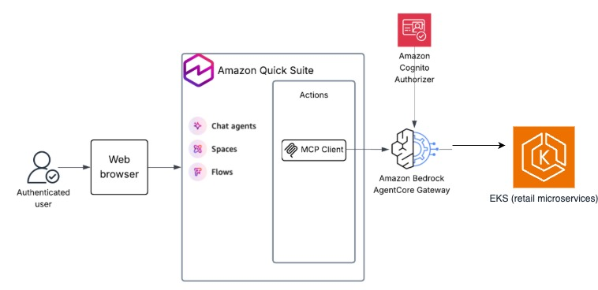
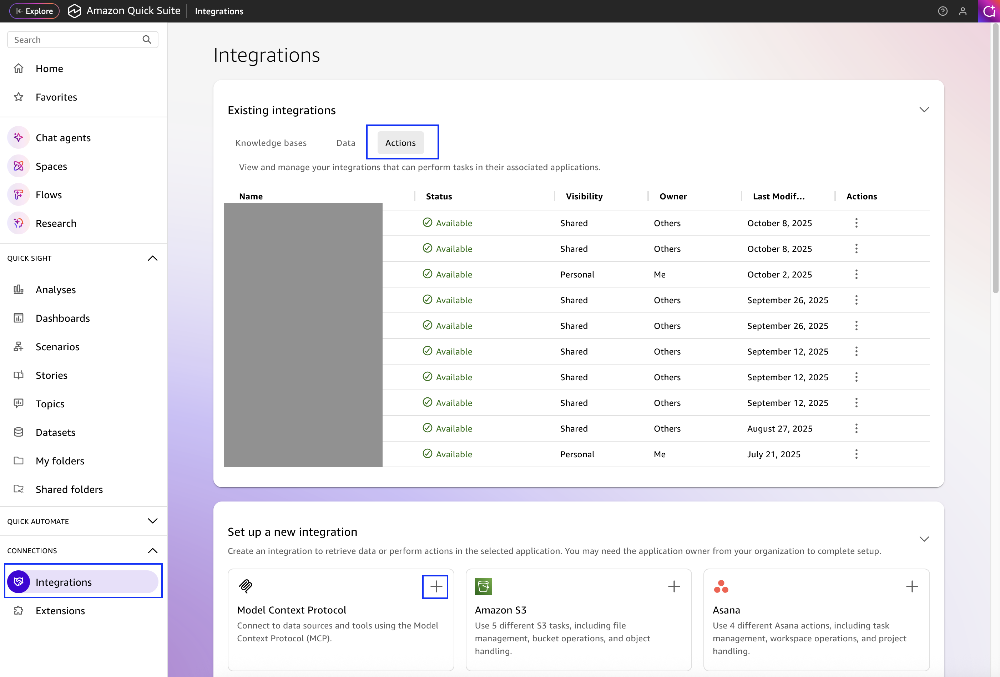
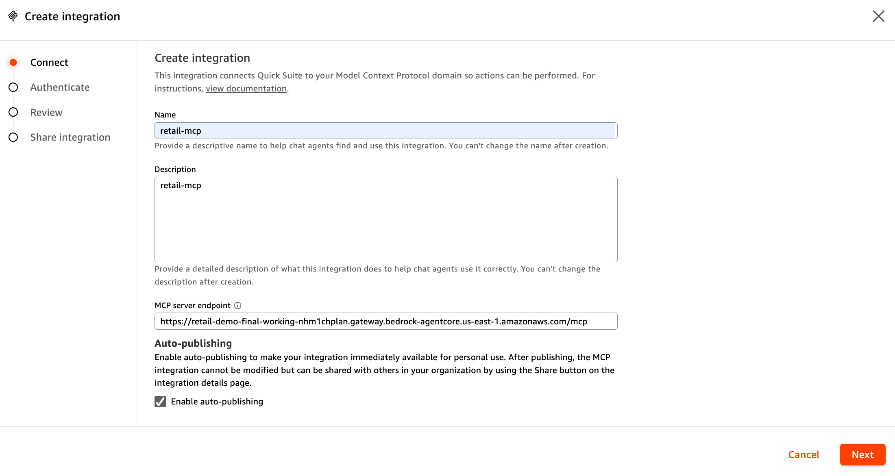
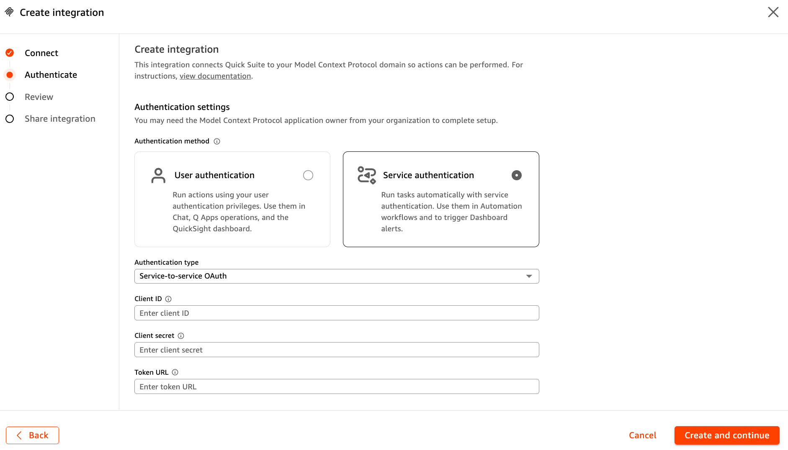
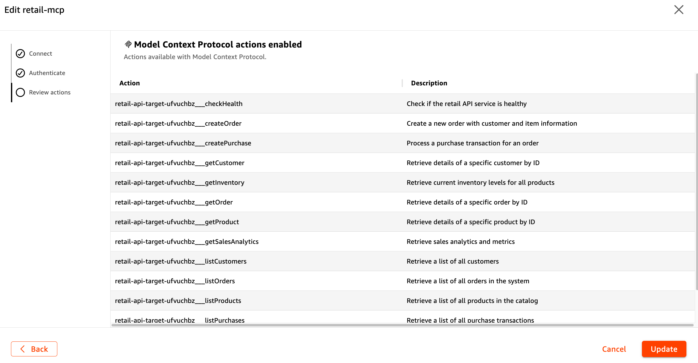
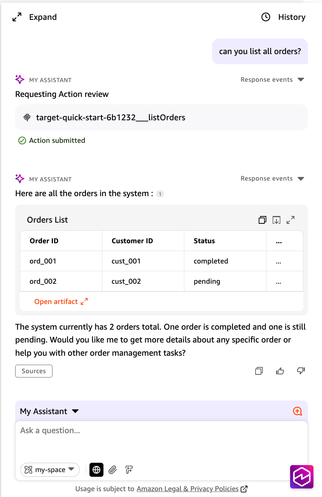

# Sample: MCPifying APIs with Amazon Bedrock AgentCore Gateway

> **⚠️ Important:** This sample is for learning and demonstration purposes only. It is not intended for production use without additional security controls, testing, and configuration changes appropriate to your environment.

*Transform your EKS applications into intelligent agent tools using Amazon Bedrock AgentCore Gateway and the Model Context Protocol (MCP)*

This AWS sample demonstrates how to "MCPify" existing REST APIs by transforming them into AI agent tools that can be discovered and used through natural language interactions. The sample shows the complete architecture: **Amazon QuickSuite → AgentCore Gateway → EKS Application**.

## Table of Contents

- [Architecture Overview](#architecture-overview)
- [What You'll Learn](#what-youll-learn)
- [Understanding the Key Technologies](#understanding-the-key-technologies)
- [What Does "MCPifying" Actually Mean?](#what-does-mcpifying-actually-mean)
- [DynamoDB Data Model](#dynamodb-data-model)
- [Getting Started with the Sample](#getting-started-with-the-sample)
- [Complete Deployment Guide](#complete-deployment-guide)
  - [Step 1: HTTPS Setup](#step-1-https-setup)
  - [Step 2: EKS Cluster Setup](#step-2-eks-cluster-setup)
  - [Step 3: Deploy the Retail Application](#step-3-deploy-the-retail-application)
  - [Step 4: Test Your Sample Application](#step-4-test-your-sample-application)
  - [Step 5: Deploy AgentCore Gateway](#step-5-deploy-agentcore-gateway)
  - [Step 6: Configure QuickSuite Integration](#step-6-configure-quicksuite-integration)
  - [Step 7: Test the Complete Integration](#step-7-test-the-complete-integration)
- [API Endpoints and CRUD Operations](#api-endpoints-and-crud-operations)
- [Troubleshooting Common Issues](#troubleshooting-common-issues)
- [Security Considerations](#security-considerations)
- [Contributing](#contributing)
- [Support](#support)

## Architecture Overview

This sample implements a complete MCPification architecture that transforms a traditional retail REST API into AI agent tools:



**Key Components:**
- **Amazon QuickSuite**: Business intelligence platform with natural language interface
- **Amazon Bedrock AgentCore Gateway**: Converts REST APIs to MCP-compatible tools
- **Amazon EKS**: Hosts the retail application with Kubernetes orchestration
- **Amazon DynamoDB**: NoSQL database for storing retail data (orders, products, customers, purchases)
- **Amazon Cognito**: Provides OAuth 2.0 authentication for secure access
- **AWS Certificate Manager**: Manages SSL/TLS certificates for HTTPS
- **IAM Roles for Service Accounts (IRSA)**: Secure access to DynamoDB from EKS pods

## What You'll Learn

By following this sample, you'll understand how to:

1. **Transform existing APIs** into AI agent tools without code changes
2. **Deploy AgentCore Gateway** with proper authentication and security
3. **Configure MCP integration** with Amazon QuickSuite
4. **Enable natural language interactions** with your business applications
5. **Implement secure OAuth 2.0** authentication flows
6. **Deploy containerized applications** on Amazon EKS with proper ingress

---

## Introduction: The Agent Revolution is Here

Imagine your existing REST API suddenly becoming a set of intelligent tools that AI agents can discover, understand, and use autonomously. No more writing custom integrations for every agent framework. No more maintaining separate tool definitions. Just one gateway that transforms your application into a universal agent toolkit.

This is the power of "MCPifying" your applications with Amazon Bedrock AgentCore Gateway.

In this deep dive, we'll walk through transforming a real-world retail application running on Amazon EKS into a set of MCP (Model Context Protocol) tools that Amazon QuickSuite can use. We'll build the complete architecture: **Amazon QuickSuite → AgentCore Gateway → EKS Application**, covering every component from Cognito authentication to natural language interactions, showing you exactly how to bridge the gap between traditional applications and the agent-driven future.

## Understanding the Key Technologies

Before we dive into MCPifying applications, let's understand the key technologies that make this transformation possible.

### What is the Model Context Protocol (MCP)?

**MCP** is an open standard that lets AI agents discover and use tools automatically. Think of it as a universal language - any MCP-compatible agent can use any MCP server without custom integration code.

### What is Amazon Bedrock AgentCore?

**Amazon Bedrock AgentCore** enables you to deploy and operate highly effective agents securely, at scale using any framework and model. With AgentCore, developers can accelerate AI agents into production with the scale, reliability, and security critical to real-world deployment. AgentCore provides tools and capabilities to make agents more effective and capable, purpose-built infrastructure to securely scale agents, and controls to operate trustworthy agents. AgentCore services are composable and work with popular open-source frameworks and any model, so you don't have to choose between open-source flexibility and enterprise-grade security and reliability.

**AgentCore Gateway** *(Our Focus)*
Amazon Bedrock AgentCore Gateway provides an easy and secure way for developers to build, deploy, discover, and connect to tools at scale. AI agents need tools to perform real-world tasks—from querying databases to sending messages to analyzing documents. With Gateway, developers can convert APIs, Lambda functions, and existing services into Model Context Protocol (MCP)-compatible tools and make them available to agents through Gateway endpoints with just a few lines of code. Gateway supports OpenAPI, Smithy, and Lambda as input types, and is the only solution that provides both comprehensive ingress authentication and egress authentication in a fully-managed service. Gateway also provides 1-click integration with several popular tools such as Salesforce, Slack, Jira, Asana, and Zendesk. Gateway eliminates weeks of custom code development, infrastructure provisioning, and security implementation so developers can focus on building innovative agent applications.

**📖 Learn More:** For additional insights on accelerating development with AgentCore, see the AWS blog post: [Accelerate development with the Amazon Bedrock AgentCore MCP Server](https://aws.amazon.com/blogs/machine-learning/accelerate-development-with-the-amazon-bedrock-agentcore-mcpserver/).

### What is Amazon QuickSuite?

**Amazon QuickSuite** is a comprehensive, generative AI-powered business intelligence platform that makes it easy to analyze data, create visualizations, automate workflows, and collaborate across your organization. The service combines traditional business intelligence capabilities with modern AI assistance, requiring no machine learning expertise to use. You can connect to diverse data sources, create interactive dashboards, build intelligent automations, and get immediate insights through natural language conversations with AI agents.

**QuickSuite Chat Agents** help users explore data, analyze information, and take actions through natural language conversations. Chat agents can evolve from simple question-answering interfaces to advanced functions that orchestrate complex workflows using connected tools - like your MCPified retail API.

**Perfect for MCPification:**
- **Built-in MCP Support**: Native integration with MCP servers like AgentCore Gateway
- **Natural Language Interface**: Ask "Show me all orders" and get data + visualizations
- **No ML Expertise Required**: Business users can interact with complex systems easily
- **Workflow Automation**: Build intelligent automations using your MCPified tools

## What Does "MCPifying" Actually Mean?

**MCPifying** is the process of transforming existing applications and APIs into Model Context Protocol (MCP) compatible tools. Instead of your API being just a collection of endpoints, it becomes a discoverable, self-describing toolkit that AI agents can understand and use intelligently.

Here's what happens when you MCPify an application:

**Before MCPifying:**
```
User → Custom Integration → EKS Application
```

**After MCPifying (Sample Architecture):**
```
User → Amazon QuickSuite → AgentCore Gateway → EKS Application
```

The magic is in that middle layer - AgentCore Gateway acts as a universal translator that:
- Converts your OpenAPI specification into MCP tool definitions
- Handles authentication and authorization
- Provides semantic search for tool discovery
- Manages rate limiting and error handling
- Offers a standardized interface for any agent framework

### The Complete Flow

**Business User** → **QuickSuite** → **AgentCore Gateway** → **Your EKS Application**

QuickSuite connects to AgentCore Gateway via MCP protocol, which translates requests to your existing REST API. Your application doesn't need to change - it just gains AI superpowers!

## DynamoDB Data Model

This sample uses Amazon DynamoDB as the persistent data store for all retail data. The implementation follows DynamoDB best practices with a single-table design pattern.

### Table Structure

**Table Name**: `RetailData`

**Primary Keys:**
- **Partition Key (PK)**: Entity type and ID (e.g., `ORDER#ord_001`, `PRODUCT#prod_001`)
- **Sort Key (SK)**: Metadata or relationship identifier (e.g., `METADATA`)

**Global Secondary Index (GSI1):**
- **GSI1PK**: Entity type for querying all items of a type (e.g., `ORDER`, `PRODUCT`)
- **GSI1SK**: Sortable attribute (e.g., timestamp, name)

### Entity Types

**1. Orders**
- **PK**: `ORDER#<order_id>`
- **SK**: `METADATA`
- **GSI1PK**: `ORDER`
- **GSI1SK**: `<created_at>` (ISO timestamp)
- **Attributes**: `id`, `customer_id`, `items`, `total`, `status`, `created_at`

**2. Products**
- **PK**: `PRODUCT#<product_id>`
- **SK**: `METADATA`
- **GSI1PK**: `PRODUCT`
- **GSI1SK**: `<name>`
- **Attributes**: `id`, `name`, `price`, `category`, `stock`

**3. Customers**
- **PK**: `CUSTOMER#<customer_id>`
- **SK**: `METADATA`
- **GSI1PK**: `CUSTOMER`
- **GSI1SK**: `<name>`
- **Attributes**: `id`, `name`, `email`, `phone`

**4. Purchases**
- **PK**: `PURCHASE#<purchase_id>`
- **SK**: `METADATA`
- **GSI1PK**: `PURCHASE`
- **GSI1SK**: `<processed_at>` (ISO timestamp)
- **Attributes**: `id`, `order_id`, `payment_method`, `payment_status`, `amount`, `transaction_id`, `processed_at`

### Data Access Patterns

The single-table design supports these efficient query patterns:

1. **Get item by ID**: Query using PK and SK
2. **List all items of a type**: Query GSI1 using GSI1PK
3. **List items sorted by attribute**: Query GSI1 using GSI1PK and GSI1SK
4. **Update item**: Update using PK and SK
5. **Delete item**: Delete using PK and SK

### IAM Roles for Service Accounts (IRSA)

The application uses IRSA to securely access DynamoDB from EKS pods without storing credentials:

- **Service Account**: `retail-api-sa` in namespace `retail-demo`
- **IAM Role**: `retail-demo-eks-retail-api-irsa`
- **Permissions**: Read/Write access to `RetailData` table and GSI1 index

### Sample Data

The application automatically seeds the database with sample data on first run:
- 2 sample orders
- 4 sample products (Laptop, Mouse, Keyboard, Monitor)
- 2 sample customers
- 1 sample purchase

## Getting Started with the Sample

*Note: This section shows you how to deploy a complete sample environment. If you already have an existing application running on EKS or any other platform, you can skip directly to the MCPification process and adapt the concepts to your existing setup.*

**🎯 Sample Repository:**
All the code, deployment scripts, and configuration files for this sample are available in this repository structure:

```bash
# Repository structure
sample-mcpify-api-with-agentcore-gateway/
├── app/                    # Flask retail application
├── k8s/                    # Kubernetes manifests
├── terraform/              # EKS infrastructure
├── scripts/                # Build and deployment scripts
└── agentcore-integration/  # AgentCore Gateway deployment
```

**🚀 Quick Start (Assuming EKS Already Exists):**

⚠️ **First**: Update placeholder values in configuration files (see Configuration Checklist below)

```bash
# 1. Build and deploy the retail application
./scripts/build-and-push.sh us-east-1 retail-api
./scripts/deploy.sh retail-demo-eks us-east-1

# 2. Deploy AgentCore Gateway
cd agentcore-integration
python deploy_retail_gateway_boto3.py --api-url https://YOUR_ACTUAL_DOMAIN

# 3. Test the complete integration
python test_deployed_gateway.py retail_gateway_config_boto3_*.json
```

**🏗️ Complete Setup (Including EKS):**
If you need to create the EKS cluster first, follow the detailed deployment steps below.

The repository includes:
- **Complete Flask application** with AgentCore Gateway compatibility
- **Kubernetes deployment manifests** for EKS
- **Terraform infrastructure** for EKS cluster setup
- **AgentCore Gateway deployment scripts** using boto3
- **Testing and validation scripts**

## Complete Deployment Guide

This section provides step-by-step instructions for deploying the complete sample environment. If you used the Quick Start above and already have everything running, you can skip to the MCPification process.

**🚨 Prerequisites:**
- **AWS Account**: With appropriate permissions for EKS, AgentCore, Cognito, and ACM
- **Custom Domain Name**: You need a domain name (e.g., `api.yourcompany.com`)
- **Domain Control**: Ability to validate domain ownership via DNS
- **AWS CLI**: Configured with appropriate credentials
- **kubectl**: For Kubernetes cluster management
- **Docker**: For building container images
- **Terraform**: For infrastructure deployment

**⚠️ IMPORTANT: Platform Architecture Compatibility**

> **If you're building on Apple Silicon (M1/M2/M3 Mac):**
> 
> Your Mac uses ARM64 architecture, but EKS nodes run on x86_64 (amd64) architecture. Docker images built on ARM will **fail to run** on EKS with errors like "exec format error" or pods stuck in CrashLoopBackOff.
>
> **Solution:** You MUST build images with the `--platform linux/amd64` flag:
> ```bash
> docker buildx build --platform linux/amd64 -t retail-api:latest .
> ```
>
> The `scripts/build-and-push.sh` script already includes this flag. If you're building manually or modifying the script, ensure this flag is present.
>
> **Verification:** After deployment, check pod logs. If you see architecture-related errors, rebuild with the correct platform flag.

**🔧 Configuration Checklist:**

Before starting deployment, you'll need to replace placeholder values in these files:

1. **`terraform/terraform.tfvars`:**
   - `domain_name = "api.yourcompany.com"` → Your actual domain

2. **`k8s/ingress.yaml`:**
   - `YOUR_ACCOUNT_ID` → Your AWS account ID (e.g., `571724487590`)
   - `YOUR_REGION` → Your AWS region (e.g., `us-east-1`)
   - `YOUR_CERTIFICATE_ID` → Your ACM certificate ID
   - `YOUR_DOMAIN` → Your actual domain (e.g., `api.yourcompany.com`)

3. **`k8s/deployment.yaml`:**
   - `YOUR_ACCOUNT_ID` → Your AWS account ID

4. **Gateway deployment command:**
   - `https://api.yourcompany.com` → Your actual domain

5. **`scripts/build-and-push.sh`:**
   - **IMPORTANT**: If building on M1/M2 Mac (ARM), add `--platform linux/amd64` to docker build command
   - EKS nodes use x86_64 architecture, so images must be built for amd64 platform

**💡 Tips:** 
- Use find-and-replace in your editor to update all placeholders consistently
- For M1/M2 Macs: Modify build script to include `docker buildx build --platform linux/amd64`

### Step 1: HTTPS Setup

AgentCore Gateway requires HTTPS endpoints. Set up your domain and SSL certificate first:

**1. Create ACM Certificate:**
```bash
# Request a certificate for your domain
aws acm request-certificate \
  --domain-name api.yourcompany.com \
  --validation-method DNS \
  --region YOUR_REGION
```

**2. Configure Route 53 (Recommended):**
```bash
# Create a hosted zone for your domain
aws route53 create-hosted-zone \
  --name api.yourcompany.com \
  --caller-reference $(date +%s)
```

**3. Validate the Certificate:**
- Go to AWS Certificate Manager console
- Find your certificate and add the CNAME record to your DNS
- Wait for validation to complete (5-10 minutes)

**4. Update Terraform Configuration:**
```hcl
# terraform/terraform.tfvars
domain_name = "api.yourcompany.com"  # Your actual domain
```

### Step 2: EKS Cluster Setup

**Create an EKS cluster using the included Terraform configuration:**

```bash
# Navigate to terraform directory
cd terraform

# Configure your settings
cp terraform.tfvars.example terraform.tfvars
# Edit terraform.tfvars with your AWS region and domain:
# - aws_region = "us-east-1"  # Your preferred region
# - domain_name = "api.yourcompany.com"  # Your actual domain

# Create the complete EKS infrastructure
terraform init
terraform plan
terraform apply

# Update your kubeconfig
aws eks update-kubeconfig --region YOUR_REGION --name retail-demo-eks
```

**The Terraform configuration creates:**
- **VPC with public/private subnets** across 3 availability zones
- **EKS cluster** with managed node groups (t3.medium instances)
- **DynamoDB table** (`RetailData`) with GSI1 index for efficient queries
- **IAM Role for Service Account (IRSA)** with DynamoDB permissions
- **Kubernetes Service Account** (`retail-api-sa`) linked to IAM role
- **Security groups** with proper ingress/egress rules
- **IAM roles** for cluster and node groups
- **AWS Load Balancer Controller** for ingress support

**DynamoDB Configuration:**
- **Billing Mode**: Pay-per-request (no capacity planning needed)
- **Point-in-Time Recovery**: Enabled for data protection
- **Encryption**: Server-side encryption enabled by default
- **Global Secondary Index**: GSI1 for efficient entity type queries

### Step 3: Deploy the Retail Application

**Prerequisites:**
- EKS cluster running with AWS Load Balancer Controller installed
- kubectl configured
- Docker image built and pushed to ECR

**⚠️ Important**: Complete the HTTPS setup process above before proceeding.

**Build and Push Docker Image:**

Use the provided script to build and push the Docker image to ECR:

```bash
# Build and push Docker image (creates ECR repository if needed)
./scripts/build-and-push.sh us-east-1 retail-api

# The script automatically:
# - Builds the Docker image from the app/ directory
# - Creates ECR repository if it doesn't exist
# - Logs into ECR
# - Tags and pushes the image
# - Outputs the image URI for deployment
```

**Deploy the Application:**

The repository includes pre-configured Kubernetes manifests (namespace, deployment, service, ingress) with HTTPS support. The ingress is configured to:
- Redirect HTTP traffic to HTTPS automatically
- Use your ACM certificate for SSL termination
- Route traffic to the retail API pods

**🔧 Important Configuration Updates:**

Before deploying, update the Kubernetes manifests with your actual values:

1. **Update `k8s/ingress.yaml`:**
   - Replace `YOUR_ACCOUNT_ID` with your AWS account ID
   - Replace `YOUR_REGION` with your AWS region
   - Replace `YOUR_CERTIFICATE_ID` with your ACM certificate ID
   - Replace `YOUR_DOMAIN` with your actual domain

2. **Update `k8s/deployment.yaml`:**
   - Replace `YOUR_ACCOUNT_ID` with your AWS account ID

**Deploy to EKS:**

Use the provided deployment script:

```bash
# Deploy the retail API to EKS (installs ALB controller if needed)
./scripts/deploy.sh retail-demo-eks us-east-1

# The script automatically:
# - Updates kubeconfig for the specified cluster
# - Installs AWS Load Balancer Controller
# - Applies all Kubernetes manifests from k8s/
# - Waits for deployment to be ready
# - Shows the ALB endpoint

# Check deployment status manually if needed
kubectl get deployments -n retail-demo
kubectl get pods -n retail-demo
kubectl get ingress -n retail-demo
kubectl get sa retail-api-sa -n retail-demo  # Verify service account
```

**Verify DynamoDB Integration:**

After deployment, verify that the application can access DynamoDB:

```bash
# Check pod logs for DynamoDB initialization
kubectl logs -n retail-demo -l app=retail-api --tail=50

# You should see logs like:
# "DynamoDB client initialized for table: RetailData"
# "Seeding database with sample data..."
# "Seeded 2 orders, 4 products, 2 customers, 1 purchases"

# Verify data in DynamoDB
aws dynamodb scan --table-name RetailData --limit 5

# Check service account annotation (should show IAM role ARN)
kubectl describe sa retail-api-sa -n retail-demo
```

**Configure DNS (Final Step):**

After deployment, point your domain to the ALB endpoint:

```bash
# Get the ALB endpoint
ALB_ENDPOINT=$(kubectl get ingress retail-api-ingress -n retail-demo -o jsonpath='{.status.loadBalancer.ingress[0].hostname}')
echo "ALB Endpoint: $ALB_ENDPOINT"

# Option 1: Route 53 (if you set up Route 53 in the HTTPS Setup Guide)
aws route53 change-resource-record-sets \
  --hosted-zone-id YOUR_HOSTED_ZONE_ID \
  --change-batch '{
    "Changes": [{
      "Action": "CREATE",
      "ResourceRecordSet": {
        "Name": "api.yourcompany.com",
        "Type": "CNAME",
        "TTL": 300,
        "ResourceRecords": [{"Value": "'$ALB_ENDPOINT'"}]
      }
    }]
  }'

# Option 2: Other DNS providers - Create a CNAME record:
# Name: api.yourcompany.com
# Type: CNAME  
# Value: [ALB_ENDPOINT from above]

# Wait for DNS propagation (5-15 minutes)
nslookup api.yourcompany.com
```

### Step 4: Test Your Sample Application

Once deployed, test your endpoints using the actual deployed URL:

```bash
# Replace with your actual deployed application URL
API_URL="https://YOUR_DOMAIN"

# Test health check
curl $API_URL/health

# Test orders
curl $API_URL/orders

# Test products
curl $API_URL/products

# Test specific product
curl $API_URL/product/prod_001

# Test creating an order
curl -X POST $API_URL/order \
  -H "Content-Type: application/json" \
  -d '{
    "customer_id": "cust_001",
    "items": [
      {"product_id": "prod_001", "name": "Laptop", "quantity": 1, "price": 999.99}
    ]
  }'

# Test analytics
curl $API_URL/analytics/sales

# Test inventory
curl $API_URL/inventory
```

**Expected Response Examples:**

```json
// GET /health
{
  "status": "healthy",
  "timestamp": "2024-01-29T15:30:45.123456"
}

// GET /orders
{
  "orders": [
    {
      "id": "ord_001",
      "customer_id": "cust_001",
      "items": [
        {"product_id": "prod_001", "name": "Laptop", "quantity": 1, "price": 999.99}
      ],
      "total": 1059.97,
      "status": "completed",
      "created_at": "2024-01-15T10:30:00Z"
    }
  ],
  "count": 2
}
```

Now that we have our sample application running, let's proceed to MCPify it!

## Step 5: Deploy AgentCore Gateway

Now that your EKS cluster is running and the retail application is deployed and tested, let's MCPify it by deploying the AgentCore Gateway.

### Prerequisites for Gateway Deployment:
- ✅ HTTPS setup completed (Step 1)
- ✅ EKS cluster is running (Step 2)
- ✅ Retail application is deployed and accessible via HTTPS (Steps 3-4)
- ✅ AWS CLI configured with AgentCore permissions

**Verify HTTPS is Working:**
```bash
# This should work without SSL errors (replace with your actual domain)
curl https://YOUR_ACTUAL_DOMAIN/health
```

### Deploy the AgentCore Gateway:

```bash
# Navigate to the agentcore-integration directory
cd agentcore-integration

# Deploy AgentCore Gateway with your actual API URL
python deploy_retail_gateway_boto3.py --api-url https://YOUR_ACTUAL_DOMAIN

# The script automatically handles:
# - IAM service role creation with proper trust policies
# - Cognito User Pool and OAuth configuration
# - AgentCore Gateway creation with MCP protocol
# - OpenAPI target setup with your application endpoints
# - Configuration file generation for integration

# Test the deployed gateway
python test_deployed_gateway.py retail_gateway_config_boto3_*.json
```

**🔗 Important: Update Your API URL**

**🔧 Configuration Requirements:**
- Replace `https://YOUR_ACTUAL_DOMAIN` with your actual domain from Step 1
- Ensure this matches the domain you configured in `k8s/ingress.yaml` and `terraform/terraform.tfvars`
- The script automatically updates the OpenAPI specification with your URL
- This ensures AgentCore Gateway connects to your deployed EKS application

### What the Deployment Script Creates

The `deploy_retail_gateway_boto3.py` script creates a complete AgentCore Gateway infrastructure with the following components:

#### **1. IAM Service Role (`RetailGatewayServiceRole`)**
Creates an IAM role with trust policies that allows AgentCore Gateway to securely access AWS services and manage gateway operations with proper logging permissions.

#### **2. Amazon Cognito User Pool & OAuth Configuration**
Creates a complete OAuth 2.0 authentication system with User Pool, domain, resource server, and app client to enable secure machine-to-machine authentication for QuickSuite integration.

#### **3. AgentCore Gateway**
Creates a fully managed MCP-compatible gateway service with OAuth JWT authorization and semantic search capabilities that transforms your REST API into discoverable MCP tools.

#### **4. API Key Credential Provider**
Creates a credential provider that handles API key authentication in HTTP headers, ensuring secure access patterns even for demo/public APIs.

#### **5. OpenAPI Target**
Creates the target configuration that links your retail API to the gateway. The script dynamically generates a complete OpenAPI specification with your actual API URL and all 12 retail endpoints, then converts each endpoint into MCP tool definitions that agents can discover and use.

#### **6. Configuration File (`retail_gateway_config_boto3_*.json`)**
Generates a complete configuration file with OAuth credentials, gateway URLs, and all connection details needed for QuickSuite integration and testing.

**Result:** Your retail API is now MCPified and ready for AI agent integration!

## Step 5.1: Gather Configuration Details

Before configuring QuickSuite, you need to collect the connection details from your deployed AgentCore Gateway.

### Find Your Gateway Configuration

The deployment script created a configuration file with all the details you need. Look for a file named `retail_gateway_config_boto3_*.json` in the `agentcore-integration` directory.

**📋 Required Information for QuickSuite:**

1. **MCP Server Endpoint**: 
   - Found in config file as `gateway_url`
   - Format: `https://YOUR_GATEWAY_ID.gateway.bedrock-agentcore.YOUR_REGION.amazonaws.com/mcp`

2. **Client ID**: 
   - Found in config file as `client_id`
   - Example: `YOUR_CLIENT_ID`

3. **Client Secret**: 
   - Found in config file as `client_secret`
   - Example: `YOUR_CLIENT_SECRET`

4. **Token URL**: 
   - Found in config file as `token_endpoint`
   - Format: `https://YOUR_COGNITO_DOMAIN.auth.YOUR_REGION.amazoncognito.com/oauth2/token`

### View Your Configuration File

```bash
# Navigate to agentcore-integration directory
cd agentcore-integration

# List the generated config files
ls retail_gateway_config_boto3_*.json

# View the configuration (replace with your actual filename)
cat retail_gateway_config_boto3_*.json
```

**Example Configuration File:**
```json
{
  "gateway_url": "https://retail-demo-boto3-abc123-xyz789.gateway.bedrock-agentcore.us-east-1.amazonaws.com/mcp",
  "gateway_id": "retail-demo-boto3-abc123-xyz789",
  "client_id": "YOUR_CLIENT_ID_HERE",
  "client_secret": "YOUR_CLIENT_SECRET_HERE",
  "token_endpoint": "https://retail-demo-boto3-abc123-domain-abc123.auth.us-east-1.amazoncognito.com/oauth2/token",
  "scope": "retail-demo-boto3-abc123/genesis-gateway:invoke",
  "region": "us-east-1"
}
```

**💡 Keep this information handy** - you'll need it in the next step to configure QuickSuite.

### Alternative: Find Values in AWS Console

If you can't find the config file, you can also retrieve these values from the AWS Console:

**MCP Server Endpoint:**
1. Go to Amazon Bedrock console → AgentCore → Gateways
2. Find your gateway (name starts with `retail-demo-boto3-`)
3. Copy the Gateway URL and add `/mcp` at the end

**OAuth Credentials:**
1. Go to Amazon Cognito console → User pools
2. Find your user pool (name starts with `retail-demo-boto3-`)
3. Go to "App integration" → "App clients and analytics"
4. Find your app client to get the Client ID and Client Secret
5. Go to "App integration" → "Domain" to construct the Token URL

## Step 6: Configure QuickSuite Integration

With your AgentCore Gateway deployed and configuration details ready, let's connect it to Amazon QuickSuite for natural language interactions.

### Configure QuickSuite MCP Integration

**1. Access MCP Settings in QuickSuite**

Navigate to the MCP configuration section in QuickSuite to add your AgentCore Gateway as an MCP server. Look for the "Integrations" section in your QuickSuite under connections.



**2. Add New MCP Server Configuration**

Click "Model Context Protocol" to begin configuring your AgentCore Gateway connection. This opens the MCP server configuration form where you'll define the connection parameters.



Configure these essential settings using values from your config file:
- **Name**: `Retail Demo Gateway` (or any name you prefer)
- **Description**: `MCPified retail API for order and product management`
- **MCP server endpoint**: Copy the `gateway_url` value from your config file
  - Example: `https://retail-demo-boto3-abc123-xyz789.gateway.bedrock-agentcore.us-east-1.amazonaws.com/mcp`

**3. Configure OAuth 2.0 Authentication**

Set up the OAuth credentials using the values from your gateway configuration file from Step 5.1.



**Authentication Settings Configuration:**

1. **Authentication Method**: Select **Service authentication**
2. **Authentication Type**: The system will automatically detect OAuth 2.0 client credentials
3. **Required OAuth 2.0 Fields** (copy from your config file):
   - **Client ID**: Copy the `client_id` value from your config file
   - **Client Secret**: Copy the `client_secret` value from your config file  
   - **Token URL**: Copy the `token_endpoint` value from your config file

**💡 Tip**: Keep your config file open in a text editor to easily copy these values.

**4. Test Connection and Discover Tools**

QuickSuite will automatically test the OAuth connection and discover all available MCP tools from your AgentCore Gateway.



**5. Integration Complete**

Your MCP integration is now fully configured and ready for use. You should see all your retail API tools available.



## Step 7: Test the Complete Integration

Now you can interact with your retail application through natural language:

**Example Business Intelligence Interactions:**

*Business User*: "Show me all the orders"
*QuickSuite*: *Uses MCP client to call `listOrders` tool via AgentCore Gateway*
*Response*: Displays an interactive dashboard with order data and insights

*Business User*: "What's our current inventory situation?"
*QuickSuite*: *Calls `getInventory` tool through MCP*
*Response*: Creates a comprehensive inventory dashboard with stock levels and alerts

*Business User*: "Create an order for our top customer"
*QuickSuite*: *Calls multiple tools: `listCustomers`, then `createOrder`*
*Response*: Creates order and updates dashboards in real-time

## Congratulations! Your Application is Now MCPified

You've successfully transformed your retail application from a traditional REST API into an intelligent agent toolkit.

**Your API Tools:**
Your retail endpoints (`/health`, `/orders`, `/products`, etc.) are now MCP tools (`checkHealth`, `listOrders`, `listProducts`, etc.) that AI agents can discover, understand, and use in natural language conversations.

## API Endpoints and CRUD Operations

The retail API provides comprehensive CRUD (Create, Read, Update, Delete) operations for all entities, backed by DynamoDB.

### Orders

**List all orders**
```bash
GET /orders
Response: {"orders": [...], "count": 2}
```

**Get specific order**
```bash
GET /order/<order_id>
Response: {"id": "ord_001", "customer_id": "cust_001", ...}
```

**Create new order**
```bash
POST /order
Body: {
  "customer_id": "cust_001",
  "items": [
    {"product_id": "prod_001", "name": "Laptop", "quantity": 1, "price": 999.99}
  ]
}
Response: {"id": "ord_abc123", "status": "pending", ...}
```

**Update order**
```bash
PUT /order/<order_id>
Body: {"status": "completed"}
Response: {"id": "ord_001", "status": "completed", ...}
```

**Delete order**
```bash
DELETE /order/<order_id>
Response: {"message": "Order ord_001 deleted successfully"}
```

### Products

**List all products**
```bash
GET /products
Response: {"products": [...], "count": 4}
```

**Get specific product**
```bash
GET /product/<product_id>
Response: {"id": "prod_001", "name": "Laptop", "price": 999.99, ...}
```

**Create new product**
```bash
POST /product
Body: {
  "name": "Tablet",
  "price": 499.99,
  "category": "Electronics",
  "stock": 25
}
Response: {"id": "prod_xyz789", ...}
```

**Update product**
```bash
PUT /product/<product_id>
Body: {"stock": 100, "price": 899.99}
Response: {"id": "prod_001", "stock": 100, ...}
```

**Delete product**
```bash
DELETE /product/<product_id>
Response: {"message": "Product prod_001 deleted successfully"}
```

### Customers

**List all customers**
```bash
GET /customers
Response: {"customers": [...], "count": 2}
```

**Get specific customer**
```bash
GET /customer/<customer_id>
Response: {"id": "cust_001", "name": "John Doe", ...}
```

**Create new customer**
```bash
POST /customer
Body: {
  "name": "Alice Johnson",
  "email": "alice@example.com",
  "phone": "+1-555-0125"
}
Response: {"id": "cust_xyz789", ...}
```

**Update customer**
```bash
PUT /customer/<customer_id>
Body: {"email": "newemail@example.com"}
Response: {"id": "cust_001", "email": "newemail@example.com", ...}
```

**Delete customer**
```bash
DELETE /customer/<customer_id>
Response: {"message": "Customer cust_001 deleted successfully"}
```

### Purchases

**List all purchases**
```bash
GET /purchases
Response: {"purchases": [...], "count": 1}
```

**Create new purchase**
```bash
POST /purchase
Body: {
  "order_id": "ord_001",
  "payment_method": "credit_card",
  "amount": 1059.97
}
Response: {"id": "pur_xyz789", "transaction_id": "txn_abc123", ...}
```

### Analytics & Inventory

**Get inventory status**
```bash
GET /inventory
Response: {
  "inventory": [
    {"product_id": "prod_001", "name": "Laptop", "stock": 50}
  ],
  "total_products": 4
}
```

**Get sales analytics**
```bash
GET /analytics/sales
Response: {
  "total_sales": 1059.97,
  "completed_orders": 1,
  "average_order_value": 1059.97
}
```

### Data Type Handling

**Important**: The application automatically handles data type conversions for DynamoDB:
- All numeric values (prices, quantities, totals) are converted to `Decimal` type for DynamoDB storage
- Responses automatically convert `Decimal` back to `float` for JSON serialization
- This ensures precision for financial calculations and DynamoDB compatibility

### Authentication

All endpoints support optional API key authentication via headers:
- `X-API-Key: your-api-key`
- `X-Dummy-Auth: your-api-key`

For this demo, any API key is accepted. In production, implement proper key validation.


## Troubleshooting Common Issues

### Issue 1: OAuth Token Failures

**Symptoms**: 401 Unauthorized errors
**Solutions**:
- Verify client ID and secret
- Check token endpoint URL
- Ensure scope matches resource server configuration
- Validate Cognito domain is active

### Issue 2: Tool Discovery Problems

**Symptoms**: Empty tool list or missing tools
**Solutions**:
- Validate OpenAPI specification syntax
- **Ensure OpenAPI spec uses HTTPS URLs** (required by AgentCore Gateway)
- **Verify API key authentication is defined** in OpenAPI spec security section
- Check gateway target status
- Verify IAM role permissions
- Review CloudWatch logs for parsing errors

### Issue 3: Tool Call Failures

**Symptoms**: Tools discovered but calls fail
**Solutions**:
- Test underlying API directly
- Check credential provider configuration
- Validate request/response schemas
- Review gateway exception logs

### Issue 4: DynamoDB Access Errors

**Symptoms**: 500 errors or "Access Denied" when calling API endpoints
**Solutions**:
- **Verify IRSA configuration**: Check that the service account annotation matches the IAM role ARN
  ```bash
  kubectl describe sa retail-api-sa -n retail-demo
  ```
- **Check IAM role permissions**: Ensure the IAM role has DynamoDB permissions
  ```bash
  aws iam get-role-policy --role-name retail-demo-eks-retail-api-irsa --policy-name DynamoDBAccess
  ```
- **Verify DynamoDB table exists**: Check that the table was created by Terraform
  ```bash
  aws dynamodb describe-table --table-name RetailData
  ```
- **Check pod logs**: Look for DynamoDB-related errors
  ```bash
  kubectl logs -n retail-demo -l app=retail-api
  ```
- **Validate AWS region**: Ensure the `AWS_REGION` environment variable matches your DynamoDB table region

### Issue 5: Data Type Errors

**Symptoms**: "Float types are not supported" errors in logs
**Solutions**:
- The application automatically converts floats to Decimal for DynamoDB
- If you see this error, ensure you're using the latest version of `app/main.py`
- Check that `convert_floats_to_decimal()` function is being called before DynamoDB operations

### Issue 6: Empty Database

**Symptoms**: API returns empty lists for all entities
**Solutions**:
- The application automatically seeds sample data on first run
- Check pod logs to verify seeding completed successfully
- Manually verify data in DynamoDB:
  ```bash
  aws dynamodb scan --table-name RetailData --limit 5
  ```
- If needed, restart the pods to trigger re-seeding:
  ```bash
  kubectl rollout restart deployment/retail-api -n retail-demo
  ```

### Issue 7: Service Account Not Found

**Symptoms**: Pods fail to start with "service account not found" error
**Solutions**:
- Verify the service account was created by Terraform:
  ```bash
  kubectl get sa retail-api-sa -n retail-demo
  ```
- If missing, apply the Terraform configuration again:
  ```bash
  cd terraform && terraform apply
  ```
- Check that the namespace exists:
  ```bash
  kubectl get namespace retail-demo
  ```

## Conclusion

We've transformed a traditional REST API into an AI-native toolkit using **Amazon QuickSuite → AgentCore Gateway → EKS Application → DynamoDB**. 

**Key Takeaways:**
- MCPification creates discoverable, self-describing tools for AI agents
- Your existing APIs can become agent tools without code changes  
- DynamoDB provides scalable, serverless data persistence with IRSA security
- HTTPS and proper authentication are essential
- OpenAPI documentation becomes the foundation for agent tools
- Single-table design pattern enables efficient queries and cost optimization

Your existing applications contain functionality that agents can leverage. With AgentCore Gateway, you can unlock that potential without rewriting application code.

The agent revolution is here - it's time to MCPify your applications.

## Security Considerations

### DynamoDB Security

**Encryption:**
- Server-side encryption enabled by default using AWS managed keys
- Data encrypted at rest automatically
- Data encrypted in transit using TLS

**Access Control:**
- IAM Roles for Service Accounts (IRSA) provides secure, credential-free access
- Least privilege principle: IAM role only has permissions for RetailData table
- No AWS credentials stored in application code or container images
- Service account bound to specific namespace and pods

**Data Protection:**
- Point-in-time recovery enabled for disaster recovery
- Automatic backups maintained by AWS
- Consider enabling DynamoDB Streams for audit logging

### Application Security

**API Authentication:**
- Optional API key authentication supported
- For production: Implement proper key validation and rotation
- Consider using AWS Secrets Manager for API key storage

**Network Security:**
- Pods run in private subnets with no direct internet access
- All external traffic goes through Application Load Balancer
- HTTPS enforced for all API communications
- Security groups restrict traffic to necessary ports only

**Best Practices for Production:**
1. Enable AWS CloudTrail for DynamoDB API auditing
2. Implement request rate limiting
3. Add input validation and sanitization
4. Enable AWS WAF on the Application Load Balancer
5. Use AWS Secrets Manager for sensitive configuration
6. Implement proper error handling without exposing internal details
7. Enable VPC Flow Logs for network monitoring
8. Regular security scanning of container images
9. Implement proper RBAC in Kubernetes
10. Enable GuardDuty for threat detection

## Security Configuration

### EKS Cluster Access Control

By default, the EKS cluster API endpoint is accessible from any IP address (0.0.0.0/0) for ease of development and demonstration. For production deployments, restrict access to specific CIDR blocks:

**Configure in terraform.tfvars:**
```hcl
allowed_management_cidrs = [
  "10.0.0.0/8",      # Corporate VPN
  "203.0.113.0/24"   # Office network
]
```

**Restricting kubectl Access:**
1. Update `allowed_management_cidrs` in `terraform/terraform.tfvars`
2. Run `terraform apply`
3. Update kubeconfig: `aws eks update-kubeconfig --name retail-demo-eks --region us-east-1`
4. Verify access: `kubectl get nodes`

**Note:** The cluster has both public and private endpoint access enabled. Pods and services within the VPC can always access the cluster API through the private endpoint.

### Encryption at Rest

DynamoDB tables are encrypted using customer-managed KMS keys with automatic annual rotation enabled. The KMS key details are available in Terraform outputs:

```bash
# View KMS key information
terraform output kms_key_arn
terraform output kms_key_alias

# Example output:
# kms_key_arn = "arn:aws:kms:us-east-1:ACCOUNT:key/KEY_ID"
# kms_key_alias = "alias/retail-demo-eks-dynamodb"
```

**Key Management:**
- **Key rotation:** Automatic (annual)
- **Deletion protection:** 10-day recovery window
- **Access control:** Managed via IAM policies
- **Audit trail:** All key usage logged in CloudTrail

### IAM Permissions

**ALB Controller Wildcard Permissions:**

The AWS Load Balancer Controller requires wildcard permissions (`Resource = "*"`) for certain IAM actions because it dynamically creates and manages AWS resources (target groups, listeners, rules, security groups) based on Kubernetes Ingress resources. These wildcards are **required by AWS** and documented in the official AWS Load Balancer Controller IAM policy.

**Why wildcards are necessary:**
- The controller doesn't know resource IDs in advance
- Resources are created dynamically based on Ingress definitions
- AWS API calls like `DescribeLoadBalancers` require wildcard access
- Conditions in the policy already limit scope (e.g., `ec2:CreateAction = "CreateSecurityGroup"`)

**Required wildcards:**
- `elasticloadbalancing:*` - For ALB/NLB management
- `ec2:Describe*` - For VPC and subnet discovery
- `wafv2:*` - For WAF integration
- `shield:*` - For DDoS protection

**This is an acceptable security practice** and follows AWS-documented patterns for Kubernetes controllers.

**IRSA Role Permissions (Least Privilege):**

The retail API pod uses an IAM role with minimal required permissions:

**DynamoDB Access:**
```json
{
  "Effect": "Allow",
  "Action": [
    "dynamodb:GetItem",
    "dynamodb:PutItem",
    "dynamodb:UpdateItem",
    "dynamodb:DeleteItem",
    "dynamodb:Query",
    "dynamodb:Scan"
  ],
  "Resource": [
    "arn:aws:dynamodb:REGION:ACCOUNT:table/RetailData",
    "arn:aws:dynamodb:REGION:ACCOUNT:table/RetailData/index/GSI1"
  ]
}
```

**KMS Access:**
```json
{
  "Effect": "Allow",
  "Action": [
    "kms:Decrypt",
    "kms:DescribeKey"
  ],
  "Resource": "arn:aws:kms:REGION:ACCOUNT:key/KEY_ID"
}
```

All permissions are scoped to specific resources - no wildcards used.

### Egress Traffic

**Current Configuration:**

EKS node security groups allow unrestricted egress traffic (0.0.0.0/0) to enable:
- Container image pulls from Amazon ECR
- AWS API calls (DynamoDB, KMS, STS, CloudWatch)
- External API integrations (if needed)

**Why unrestricted egress is currently necessary:**
- Pods need to reach multiple AWS services on HTTPS (port 443)
- ECR image pulls require access to S3 and ECR endpoints
- IRSA token exchange requires STS endpoint access
- CloudWatch logging requires CloudWatch Logs endpoint access

**Future Improvements (Phase 2):**

For enhanced security, consider implementing:

1. **VPC Endpoints for AWS Services:**
   - DynamoDB VPC endpoint (Gateway type)
   - ECR VPC endpoints (Interface type)
   - S3 VPC endpoint (Gateway type)
   - STS VPC endpoint (Interface type)

2. **Restrict Egress to Specific Ports:**
   - Allow HTTPS (443) only
   - Allow DNS (53) for name resolution
   - Allow NTP (123) for time synchronization
   - Block all other outbound traffic

3. **Network Policies:**
   - Implement Kubernetes Network Policies
   - Restrict pod-to-pod communication
   - Limit external access per pod

**⚠️ Important:** Implementing egress restrictions requires thorough testing to ensure all application functionality continues to work. Test in a development environment first.

### Security Best Practices

**1. Network Isolation:**
- ✅ Restrict EKS API endpoint access to known CIDRs (configure `allowed_management_cidrs`)
- ✅ Use private endpoint for internal cluster access (already enabled)
- ✅ Deploy workloads in private subnets (already configured)
- ⏸️ Consider VPC endpoints for AWS services (Phase 2)

**2. Encryption:**
- ✅ Customer-managed KMS keys for data at rest (implemented)
- ✅ TLS 1.2+ for data in transit (enforced by ALB)
- ✅ Automatic KMS key rotation (enabled)
- ✅ Point-in-time recovery for DynamoDB (enabled)

**3. Access Control:**
- ✅ Use IRSA for pod-level IAM permissions (implemented)
- ✅ Follow least-privilege principle (scoped to specific resources)
- ✅ No AWS credentials in application code (IRSA handles this)
- 📋 Regularly audit IAM policies and access patterns

**4. Monitoring & Auditing:**
- 📋 Enable CloudTrail for API audit logs
- 📋 Monitor KMS key usage and access patterns
- 📋 Set up CloudWatch alarms for unauthorized access attempts
- 📋 Enable VPC Flow Logs for network traffic analysis
- 📋 Use AWS Config for compliance monitoring

**5. Version Management:**
- ✅ Pin Terraform module versions (implemented)
- ✅ Test infrastructure changes in non-production first
- ✅ Maintain infrastructure as code in version control
- 📋 Use Terraform workspaces for environment separation

### Example Configurations

**Development Environment (Default):**
```hcl
# terraform.tfvars
cluster_name = "retail-api-dev"
environment  = "development"
# Uses default: allowed_management_cidrs = ["0.0.0.0/0"]
```

**Production Environment (Restricted):**
```hcl
# terraform.tfvars
cluster_name = "retail-api-prod"
environment  = "production"
allowed_management_cidrs = [
  "10.0.0.0/8",      # Corporate network
  "203.0.113.50/32"  # Bastion host
]
```

**High Security Environment:**
```hcl
# terraform.tfvars
cluster_name = "retail-api-secure"
environment  = "production"
allowed_management_cidrs = [
  "10.1.2.3/32"  # Single management host only
]
```

### Verifying Security Configuration

**Check EKS Endpoint Access:**
```bash
aws eks describe-cluster --name retail-demo-eks --query 'cluster.resourcesVpcConfig.{publicAccess:endpointPublicAccess,privateAccess:endpointPrivateAccess,publicCidrs:publicAccessCidrs}'
```

**Check DynamoDB Encryption:**
```bash
aws dynamodb describe-table --table-name RetailData --query 'Table.SSEDescription'
```

**Check KMS Key Rotation:**
```bash
aws kms get-key-rotation-status --key-id $(terraform output -raw kms_key_id)
```

**Verify IRSA Role Permissions:**
```bash
aws iam get-role-policy --role-name retail-demo-eks-retail-api-irsa --policy-name KMSDecryptAccess
```

---

*Ready to MCPify your applications? Use the automated deployment script provided in this guide to get started quickly. The future of application integration is agent-native, and it starts with your first MCPified API.*

## Enhancing Code Generation with MCP Tools

Your MCPified applications can enhance your development workflow by providing live context to LLMs for code generation. Additionally, you can use the official AgentCore MCP Server in Kiro IDE to access AgentCore documentation and best practices directly during development.

**Add AgentCore MCP Server to Kiro IDE or other development tools:**
```json
{
  "mcpServers": {
    "bedrock-agentcore-mcp-server": {
      "command": "uvx",
      "args": [
        "awslabs.amazon-bedrock-agentcore-mcp-server@latest"
      ],
      "env": {
        "FASTMCP_LOG_LEVEL": "ERROR"
      },
      "disabled": false,
      "autoApprove": [
        "search_agentcore_docs",
        "fetch_agentcore_doc"
      ]
    }
  }
}
```
**Benefits of Using AgentCore MCP Server in Development:**
- **Real-time AgentCore expertise**: Access official AgentCore documentation and best practices directly in your IDE
- **Context-aware code generation**: Get accurate implementation guidance based on current AgentCore features
- **Implementation assistance**: Receive help with AgentCore Gateway integration using up-to-date official documentation
- **Best practices enforcement**: Ensure your MCPification follows AWS recommended patterns

**Additional Benefits from Your MCPified Applications:**
- **Live API context**: LLMs can query your deployed APIs for accurate data structures and schemas
- **Auto-documentation**: Generate API docs and SDKs from live endpoints
- **Real-time testing**: Validate generated code against actual running services

**Compatible with:** Kiro IDE, Cursor IDE, GitHub Copilot, Claude Desktop, or any MCP-compatible development tool.

This creates a powerful development feedback loop where both your MCPified applications and official AgentCore knowledge work together to enhance your coding capabilities!

## 🎓 Important Note

**This is a sample for learning and demonstration purposes!** This sample shows you how MCPification works with AWS services, but should not be used directly in production environments. Please:

- Review and understand all code before deployment
- Implement proper security measures for your environment
- Test thoroughly in non-production environments first
- Adapt the configuration to meet your specific requirements
- Follow AWS security best practices for production deployments

