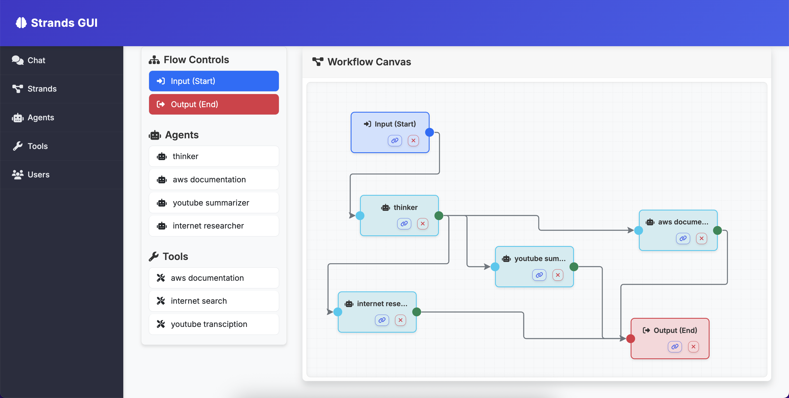
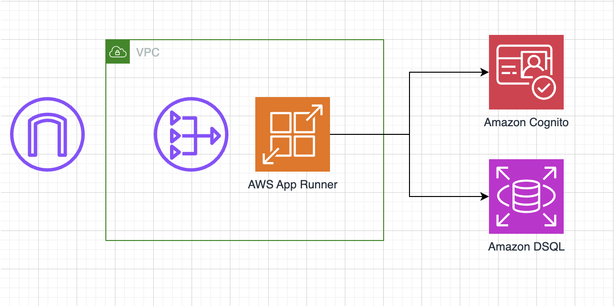

# Strands GUI

A web interface for visually configuring tools, creating agents, and building workflows.

Users can create Agents and workflows using Strands Agents, then interact and operate trough a chat interface.

DevOps can use MCP tools to integrate the UI with data sources.

Local and cloud deployment (via AWS App Runner and Amazon Aurora DSQL) options available.



 
## Local Development Setup

Runs locally in a python environment using a local sqlite database.

### Prerequisites

- Python 3.10
- AWS Command Line Interface (AWS CLI) configured with appropriated permissions
- Podman (for building containers)
- Terraform (for deployment)

### 1. Create Python Environment

```bash
# Create Python 3.10 virtual environment
python3.10 -m venv venv

# Activate the environment
source venv/bin/activate  # On macOS/Linux
# or
venv\Scripts\activate     # On Windows
```

### 2. Install Dependencies

```bash
pip install -r requirements.txt
```

### 3. Configure AWS Credentials

Ensure your AWS credentials are configured:

```bash
aws configure
```

Or set environment variables:

```bash
export AWS_ACCESS_KEY_ID=your_access_key
export AWS_SECRET_ACCESS_KEY=your_secret_key
export AWS_DEFAULT_REGION=us-east-1
```

### 4. Launch Application Locally

```bash
python app.py
```

The application will run on `http://0.0.0.0:5000` by default.

**Default Login:**
- Username: `admin@example.com`
- Password: *Randomly generated and displayed in console on first startup*

Requires a policy with access to bedrock model inference. 

## Deployment

Terraform is used to package, build the application, and deploy it to AWS App Runner.

The application will run in an Amazon Virtual Private Cloud (Amazon VPC), public access trough AWS App Runner, and will use Amazon Cognito for user managment.

Do not deploy this application to production accounts. Remove unused resources using terraform once done testing Strand Agents.




### Prerequisites for Deployment

- **Podman**: Container runtime for building images
- **Terraform**: Infrastructure as Code tool
- **AWS Command Line Interface (AWS CLI)**: Configured with appropriated permissions to create the necessary resources

### 1. Build Container Image

```bash
# Build the container image
podman build --platform=linux/amd64 -t strands-gui:latest .
```

### 2. Deploy Infrastructure

```bash
# Initialize Terraform
terraform init

# Plan the deployment
terraform plan

# Apply the infrastructure
terraform apply
```

### 3. Push Image and Deploy

The Terraform configuration automatically:
- Creates an Amazon Elastic Container Repository (Amazon ECR) instance
- Builds and pushes the Docker image using Podman
- Deploys to AWS App Runner
- Sets up Amazon Aurora DSQL database
- Configures Amazon Cognito for authentication

### 4. Post-Deployment Configuration

After deployment, update Amazon Cognito callback URLs:

```bash
# Get the command from Terraform output
terraform output update_cognito_instructions

# Run the AWS Command Line Interface (AWS CLI) command provided in the output
```

### Environment Variables

The following environment variables are configured automatically during deployment:

- `SQLALCHEMY_DATABASE_URI`: Amazon Aurira DSQL endpoint
- `COGNITO_ENABLED`: Set to `true`
- `COGNITO_USER_POOL_ID`: Auto-configured
- `COGNITO_CLIENT_ID`: Auto-configured
- `COGNITO_DOMAIN`: Auto-configured
- `COGNITO_REDIRECT_URI`: Auto-configured

### Deployment Outputs

After successful deployment, Terraform provides:

- **App URL**: The public URL of your deployed application
- **Admin Credentials**: Default admin user credentials
- **DSQL Cluster ARN**: Database cluster identifier

## Architecture

- **Frontend**: FastAPI with Jinja2 templates
- **Database**: SQLite (local) / Amazon Aurora DSQL (production)
- **Authentication**: Local users (dev) / Amazon Cognito (production)
- **Container**: Podman-built Docker image
- **Hosting**: AWS App Runner
- **Infrastructure**: Terraform-managed AWS resources

## Development Notes

- The app uses FastAPI instead of Flask (despite some legacy references)
- Built-in tools are automatically available to agents
- Custom tools can be created via the web interface
- Workflows support visual node-based editing
- Real-time chat interface for agent interaction
