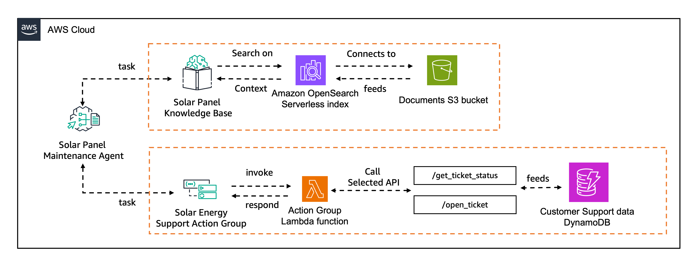
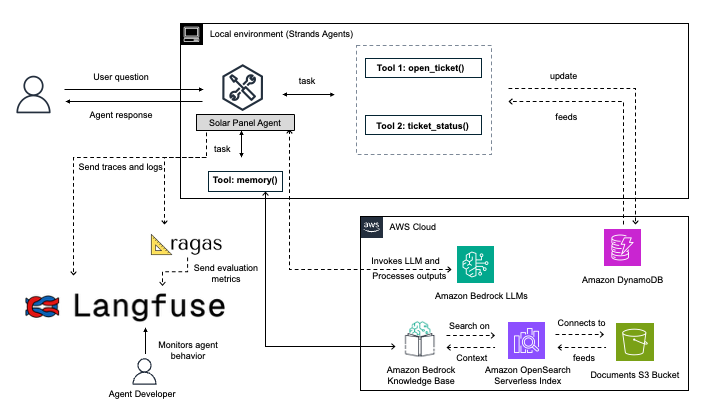
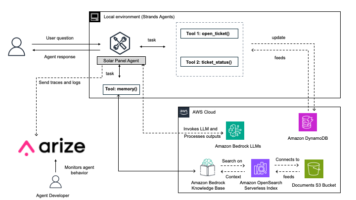
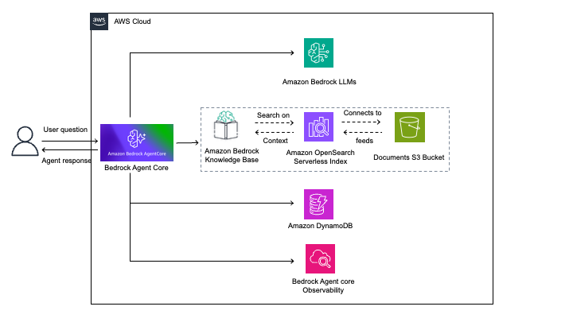

# Strands Solar Agent - Comprehensive Observability & Evaluation Demo

A comprehensive demonstration project showcasing the migration and enhancement of an AWS Bedrock Agent example into a Strands Agent implementation with multiple observability and evaluation integrations.

## 📋 Project Overview

This project demonstrates the transformation of the original [AWS Bedrock Agent with Knowledge Base Integration](https://github.com/awslabs/amazon-bedrock-agent-samples/tree/main/examples/agents/agent_with_knowledge_base_integration) into a modern Strands Agent framework with advanced observability and evaluation capabilities.

### Original Source Migration
- **Source**: AWS Bedrock Agent with Knowledge Base Integration
- **Target**: Strands Agent framework with enhanced observability
- **Agent**: Solar panel installation and maintenance support

## 🏗️ Architecture Overview

The project consists of four distinct implementations, each demonstrating different aspects of agent observability and deployment:

```
strands_solar_agent/
├── strands_agent_with_langfuse_observability/     # Core Langfuse integration
├── strands_agent_evaluation_ragas_langfuse/       # RAGAS evaluation pipeline
├── strands_agent_with_arize_observability/        # Arize platform integration
├── strands_agent_bedrock_agentcore_with_observability/  # Bedrock Agent Core deployment
└── README.md
```

### Migration Journey

The project demonstrates a complete transformation from the original AWS Bedrock Agent architecture to a modern Strands Agent implementation with comprehensive observability:

#### Before: Original AWS Bedrock Agent Architecture


The original implementation used AWS Bedrock Agent with basic knowledge base integration, providing solar panel support through AWS-managed agent infrastructure.

#### After: Strands Agent with Multiple Observability Integrations

**Strands Agent with Langfuse & RAGAS Evaluation**


This implementation showcases:
- Strands Agent framework with comprehensive Langfuse observability
- RAGAS-based evaluation pipeline for automated quality assessment
- Real-time trace collection and performance analytics

**Strands Agent with Arize Observability**


This implementation demonstrates:
- OpenTelemetry-based trace export to Arize platform
- Advanced ML observability and model drift detection
- Custom span mapping for enhanced monitoring

**Strands Agent on Bedrock Agent Core**


This implementation shows:
- Containerized Strands Agent deployment on AWS Bedrock Agent Core
- Built-in AWS observability with CloudWatch integration
- Scalable cloud deployment with external observability options

## 🚀 Key Implementations

### 1. Strands Agent with Langfuse Observability
**Directory**: `strands_agent_with_langfuse_observability/`

Demonstrates comprehensive trace monitoring and observability using Langfuse platform.

**Features**:
- Real-time trace collection and visualization
- Performance metrics and analytics
- User session tracking
- Error monitoring and debugging
- Custom metadata and tags

**Key Files**:
- `agent_with_langfuse_observability.py` - Main agent implementation
- `requirements.txt` - Dependencies
- `.env.example` - Configuration template

### 2. Strands Agent with RAGAS Evaluation Pipeline
**Directory**: `strands_agent_evaluation_ragas_langfuse/`

Automated evaluation workflow that retrieves traces from Langfuse, performs RAGAS-based evaluations, and stores results.

**Features**:
- Automated trace retrieval from Langfuse
- RAGAS-based evaluation metrics:
  - Answer Relevancy
  - Context Precision
  - Context Recall
  - Faithfulness
- Evaluation score feedback to Langfuse traces
- Local CSV storage for evaluation results
- Configurable evaluation parameters

**Key Files**:
- `evaluations.py` - Main evaluation pipeline
- `config.py` - Configuration management
- `requirements.txt` - Dependencies

### 3. Strands Agent with Arize Observability
**Directory**: `strands_agent_with_arize_observability/`

Integration sending Strands Agent traces to the Arize platform for advanced ML observability.

**Features**:
- OpenTelemetry-based trace export
- Arize platform integration
- Performance monitoring
- Model drift detection
- Custom span mapping

**Key Files**:
- `agent_with_arize_observability.py` - Main agent with Arize integration
- `strands_to_openinference_mapping.py` - Custom trace mapping
- `requirements.txt` - Dependencies

### 4. Bedrock Agent Core Deployment
**Directory**: `strands_agent_bedrock_agentcore_with_observability/`

Deployment of Strands Agent to AWS Bedrock Agent Core Runtime with comprehensive observability and monitoring capabilities.

**Features**:
- **ARM64 Containerized Deployment**: FastAPI-based agent packaged in ARM64 Docker container
- **Required Endpoints**: `/invocations` POST endpoint for agent interactions and `/ping` GET endpoint for health checks
- **Built-in AWS Observability**: CloudWatch Transaction Search, metrics, logs, and X-Ray tracing
- **ECR Integration**: Container images deployed through Amazon Elastic Container Registry
- **Scalable Runtime**: Managed infrastructure with automatic scaling and load balancing
- **External Observability Support**: Optional integration with Langfuse and Arize platforms

**Architecture Requirements**:
- **Platform**: Linux/ARM64 architecture (required by Amazon Bedrock AgentCore)
- **Port**: Application must run on port 8080
- **Container Registry**: Images must be stored in Amazon ECR
- **IAM Permissions**: Requires AgentRuntimeRole with appropriate permissions
- **Network Configuration**: Supports both public and private network modes

## 🛠️ Prerequisites

### System Requirements
- Python 3.9 or higher
- AWS CLI configured with appropriate permissions
- Docker (for Bedrock Agent Core deployment)

### AWS Services Required
- Amazon Bedrock (Claude 3.7 Sonnet model access)
- Amazon DynamoDB
- Amazon OpenSearch Service
- AWS Bedrock Knowledge Base
- AWS Bedrock Agent Core (for deployment example)

### Third-Party Platforms
- **Langfuse Account**: [Sign up at cloud.langfuse.com](https://cloud.langfuse.com)
- **Arize Account**: [Sign up at arize.com](https://arize.com)

## ⚙️ Configuration

### Environment Variables Setup

Each implementation requires specific environment variables. Copy the `.env.example` file to `.env` and configure:

#### Langfuse Configuration
```bash
# AWS Configuration
AWS_REGION=us-east-1
DYNAMODB_TABLE=your-table-name
DYNAMODB_PK=customer_id
DYNAMODB_SK=ticket_id
STRANDS_KNOWLEDGE_BASE_ID=your-knowledge-base-id

# Langfuse Configuration
LANGFUSE_PUBLIC_KEY=pk-lf-...
LANGFUSE_SECRET_KEY=sk-lf-...
LANGFUSE_HOST=https://cloud.langfuse.com

# Strands Configuration
STRANDS_MODEL=us.anthropic.claude-3-7-sonnet-20250219-v1:0
STRANDS_ENVIRONMENT=development
```

#### Arize Configuration
```bash
# AWS Configuration (same as above)
# ... 

# Arize Configuration
ARIZE_SPACE_KEY=your-space-key
ARIZE_API_KEY=your-api-key
ARIZE_MODEL_ID=strands-solar-agent
ARIZE_MODEL_VERSION=1.0.0
```

### AWS Resources Setup

#### 1. DynamoDB Table
Create a DynamoDB table for customer ticket storage:
```bash
aws dynamodb create-table \
    --table-name solar-support-tickets \
    --attribute-definitions \
        AttributeName=customer_id,AttributeType=S \
        AttributeName=ticket_id,AttributeType=S \
    --key-schema \
        AttributeName=customer_id,KeyType=HASH \
        AttributeName=ticket_id,KeyType=RANGE \
    --billing-mode PAY_PER_REQUEST
```

#### 2. Bedrock Knowledge Base (with S3 and Opensearch Serverless)
- [Set up a knowledge base with solar panel documentation](https://docs.aws.amazon.com/bedrock/latest/userguide/knowledge-base-create.html)
- Use documents from the below directory and upload them to a S3 bucket
```
strands_solar_agent/
├── strands_agent_with_langfuse_observability/kb_documents   

```

## 📦 Installation & Setup

### 1. Clone and Navigate to Project
```bash
git clone <repository-url>
cd strands_solar_agent
```

### 2. Choose Your Implementation

#### Option A: Langfuse Observability
```bash
cd strands_agent_with_langfuse_observability
python -m venv venv
source venv/bin/activate  # On Windows: venv\Scripts\activate
pip install -r requirements.txt
cp .env.example .env
# Edit .env with your configuration
python agent_with_langfuse_observability.py
```

#### Option B: RAGAS Evaluation Pipeline
```bash
cd strands_agent_evaluation_ragas_langfuse
python -m venv venv
source venv/bin/activate  # On Windows: venv\Scripts\activate
pip install -r requirements.txt
cp .env.example .env
# Edit .env with your configuration
python evaluations.py
```

#### Option C: Arize Observability
```bash
cd strands_agent_with_arize_observability
python -m venv venv
source venv/bin/activate  # On Windows: venv\Scripts\activate
pip install -r requirements.txt
cp .env.example .env
# Edit .env with your configuration
python agent_with_arize_observability.py
```

#### Option D: Bedrock Agent Core
```bash
cd strands_agent_bedrock_agentcore_with_observability

#Follow the instructions from the documentation url below
https://docs.aws.amazon.com/bedrock-agentcore/latest/devguide/getting-started-starter-toolkit.html

#To enable Agentcore Observability follow the instructions from the documentation url below
https://docs.aws.amazon.com/bedrock-agentcore/latest/devguide/observability-configure.html

```

## 📊 Observability Features

### Langfuse Dashboard
- **Traces**: Complete conversation flows with timing
- **Sessions**: User interaction patterns
- **Scores**: Evaluation metrics and feedback
- **Analytics**: Performance trends and insights

### Arize Platform
- **Model Performance**: Drift detection and monitoring
- **Embeddings**: Vector space visualization
- **Troubleshooting**: Root cause analysis
- **Alerts**: Automated issue detection

### RAGAS Evaluation Metrics
- **Answer Relevancy**: How relevant is the response to the question?
- **Faithfulness**: Is the answer grounded in the provided context?
- **Context Precision**: How precise is the retrieved context?
- **Context Recall**: How complete is the retrieved context?

### Bedrock Agent Core Metrics
- [AgentCore runtime metrics](https://docs.aws.amazon.com/bedrock-agentcore/latest/devguide/observability-runtime-metrics.html)
- [AgentCore memory metrics](https://docs.aws.amazon.com/bedrock-agentcore/latest/devguide/observability-memory-metrics.html)
- [AgentCore gateway metrics](https://docs.aws.amazon.com/bedrock-agentcore/latest/devguide/observability-gateway-metrics.html)
- [AgentCore tool metrics](https://docs.aws.amazon.com/bedrock-agentcore/latest/devguide/observability-tool-metrics.html)


## 🔧 Troubleshooting

### Common Issues

#### 1. Authentication Errors
```bash
# Verify AWS credentials
aws sts get-caller-identity

# Check Langfuse connection
curl -H "Authorization: Basic $(echo -n 'PUBLIC_KEY:SECRET_KEY' | base64)" \
     https://cloud.langfuse.com/api/public/health
```

#### 2. Missing Dependencies
```bash
# Reinstall requirements
pip install --upgrade -r requirements.txt

# Check for conflicts
pip check
```

#### 3. Knowledge Base Issues
```bash
# Verify knowledge base exists
aws bedrock-agent get-knowledge-base --knowledge-base-id YOUR_KB_ID

# Check indexing status
aws bedrock-agent list-data-sources --knowledge-base-id YOUR_KB_ID
```

#### 4. Evaluation Pipeline Errors
```bash
# Check Langfuse trace availability
python -c "
from langfuse import Langfuse
client = Langfuse()
traces = client.get_traces(limit=1)
print(f'Traces available: {len(traces.data)}')
"
```

### Performance Optimization

#### 1. Batch Processing
- Use batch evaluation for large trace volumes
- Implement parallel processing for RAGAS metrics
- Configure appropriate timeout values

#### 2. Memory Management
```python
# For large evaluation runs
import gc
gc.collect()  # Force garbage collection between batches
```

#### 3. Rate Limiting
```python
# Implement rate limiting for API calls, check for Langfuse and Arize rate/token limits
import time
time.sleep(0.1)  # Add delays between requests
```

## 📈 Monitoring & Alerts

### Key Metrics to Monitor
- **Response Time**: Agent processing latency
- **Success Rate**: Percentage of successful interactions
- **Evaluation Scores**: RAGAS metric trends
- **Error Rate**: Failed requests and exceptions
- **Token Usage**: Model consumption tracking

## 📚 Additional Resources

### Documentation Links
- [Strands Agents Documentation](https://docs.strands.ai)
- [Langfuse Documentation](https://langfuse.com/docs)
- [Arize Documentation](https://docs.arize.com)
- [RAGAS Documentation](https://docs.ragas.io)
- [AWS Bedrock Agent Core Documentation](https://docs.aws.amazon.com/bedrock/latest/userguide/agents.html)

### Example Queries for Testing
```
1. "My solar panels are producing 20% less energy than last month. What could be wrong?"
2. "How do I clean my solar panels safely?"
3. "What's the warranty coverage for inverter failures?"
4. "Can I add more panels to my existing system?"
5. "My monitoring app shows an error code E-001. What does this mean?"
```

## 📄 License

This project is licensed under the MIT License - see the LICENSE file for details.

## 🙋‍♂️ Support

For questions and support:
- Create an issue in this repository
- Check the troubleshooting section above
- Refer to the official documentation links

---

**Note**: This project is for demonstration purposes and showcases various observability and evaluation patterns. Adapt the configurations and implementations according to your specific production requirements.
